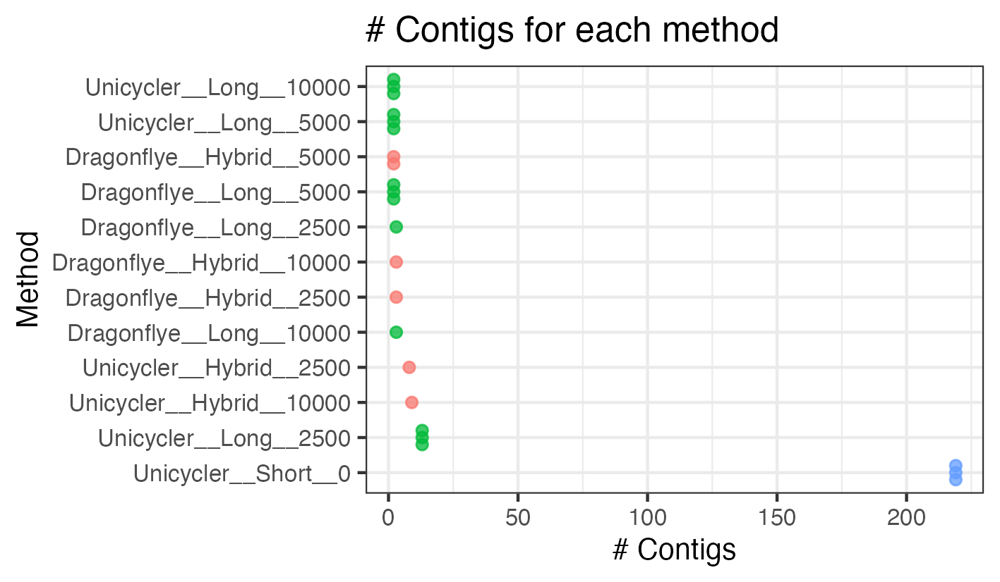
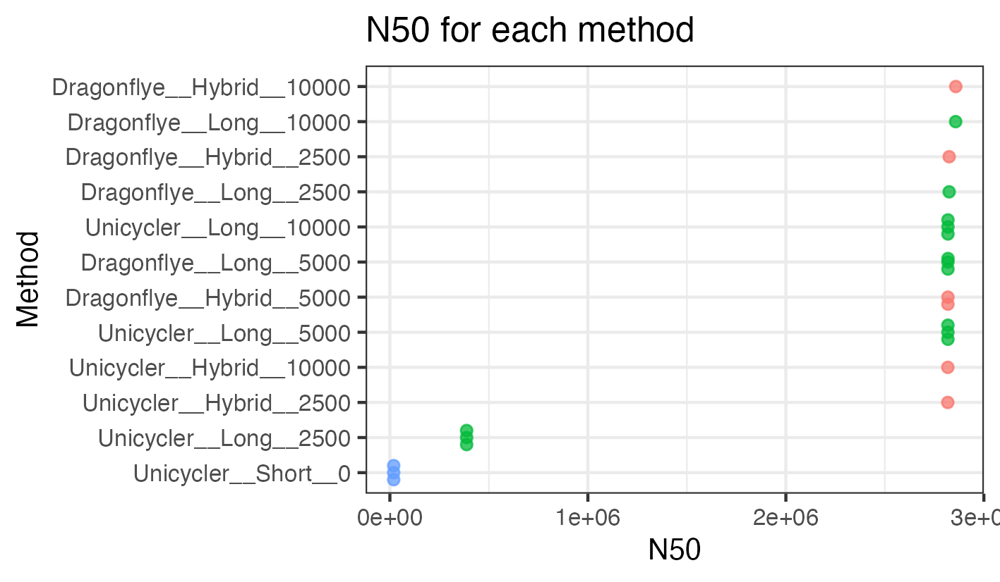
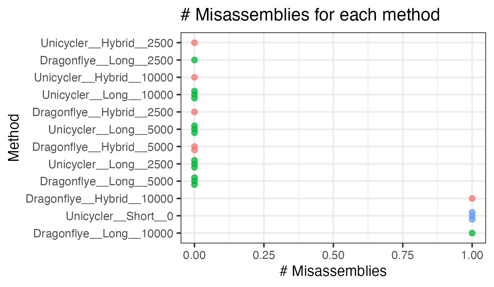
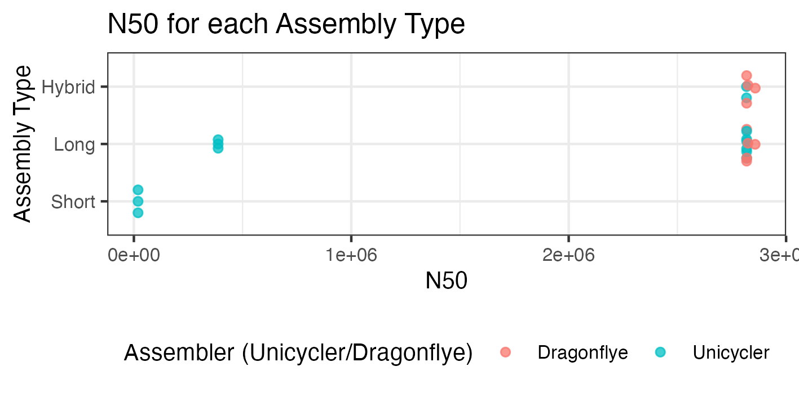
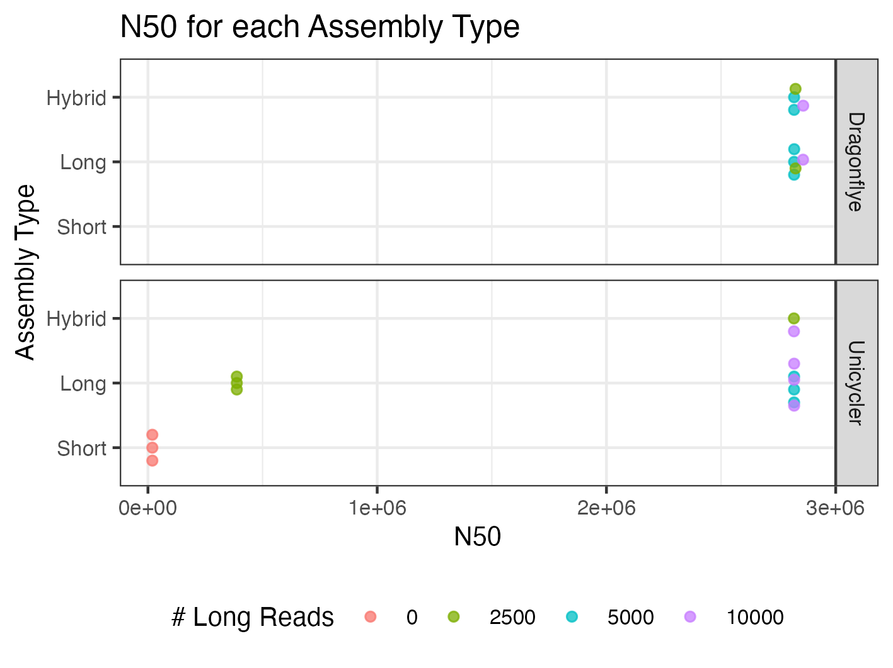
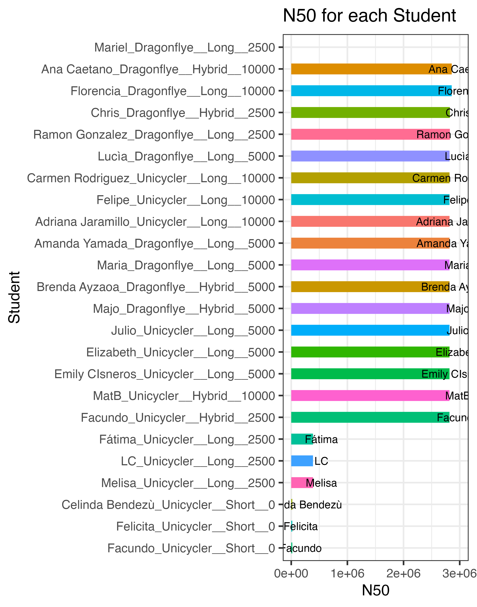
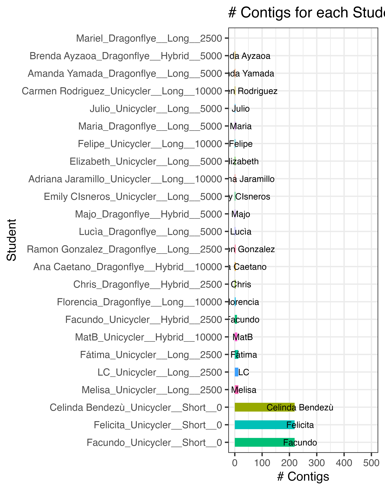

[<<< Go back to Manual Contents Page](https://github.com/WCSCourses/GenEpiLAC2023/blob/main/Manuals/README.md)

 

[<<< Go back to Assembly Comparison  Exercise Page](https://github.com/WCSCourses/GenEpiLAC2023/blob/main/Manuals/Assembly_method_comparison/Assembly_method_comparison.md)

 

# Assembly Method Comparisons - Paraguay 2023 <!-- omit in toc -->

## Class Results

 

 

 

 

 

## Results by Assembler and input

 

 

 

## Results by Student

 

 

 
