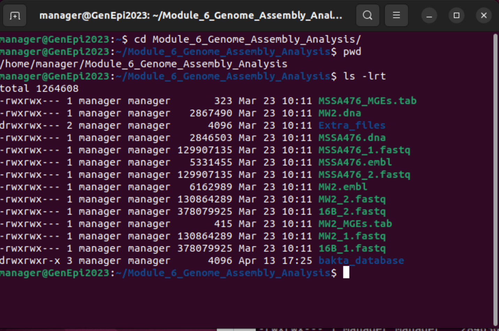
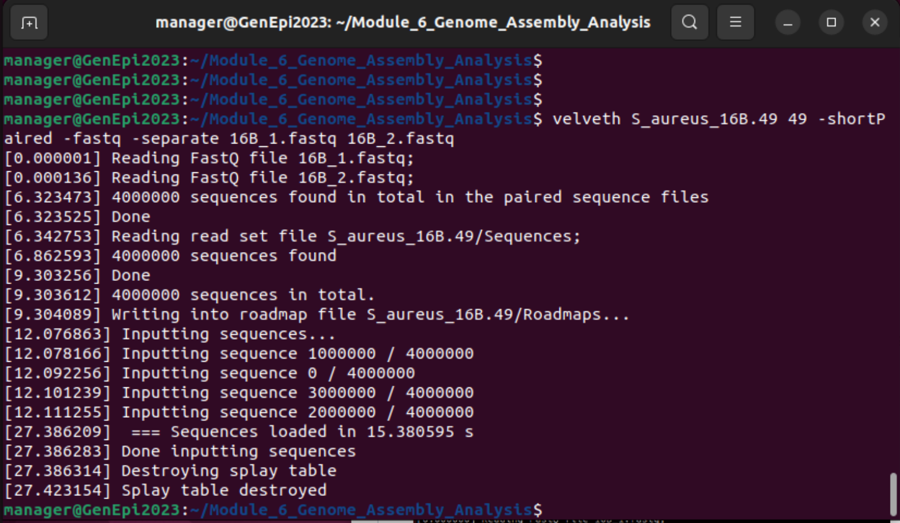
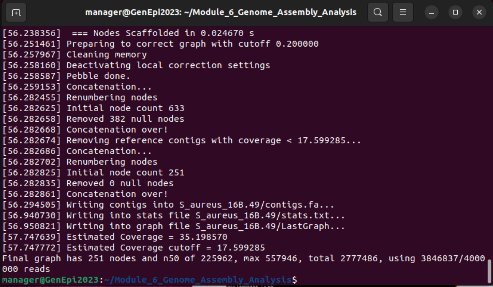
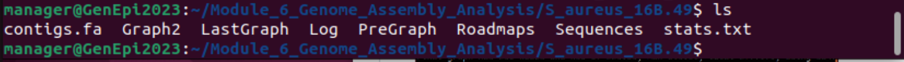
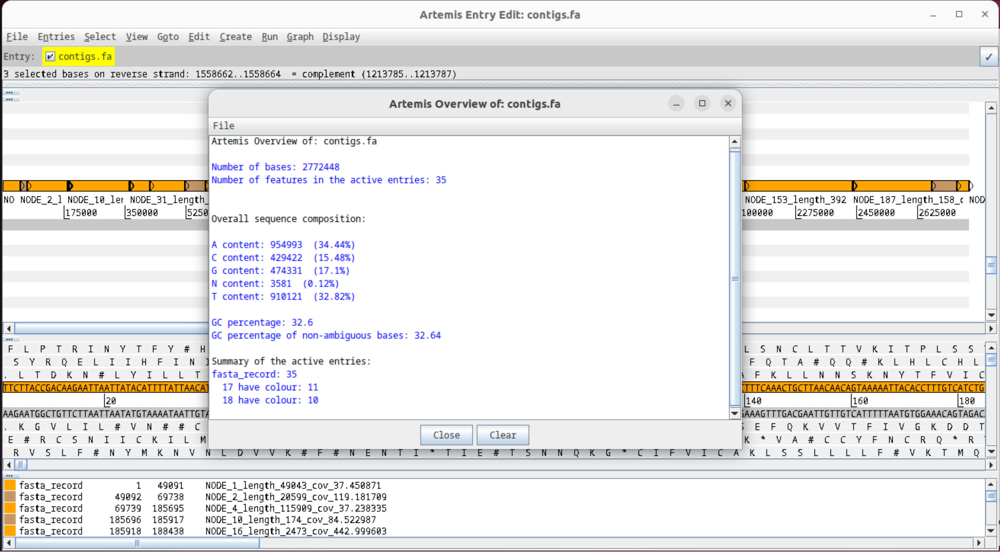
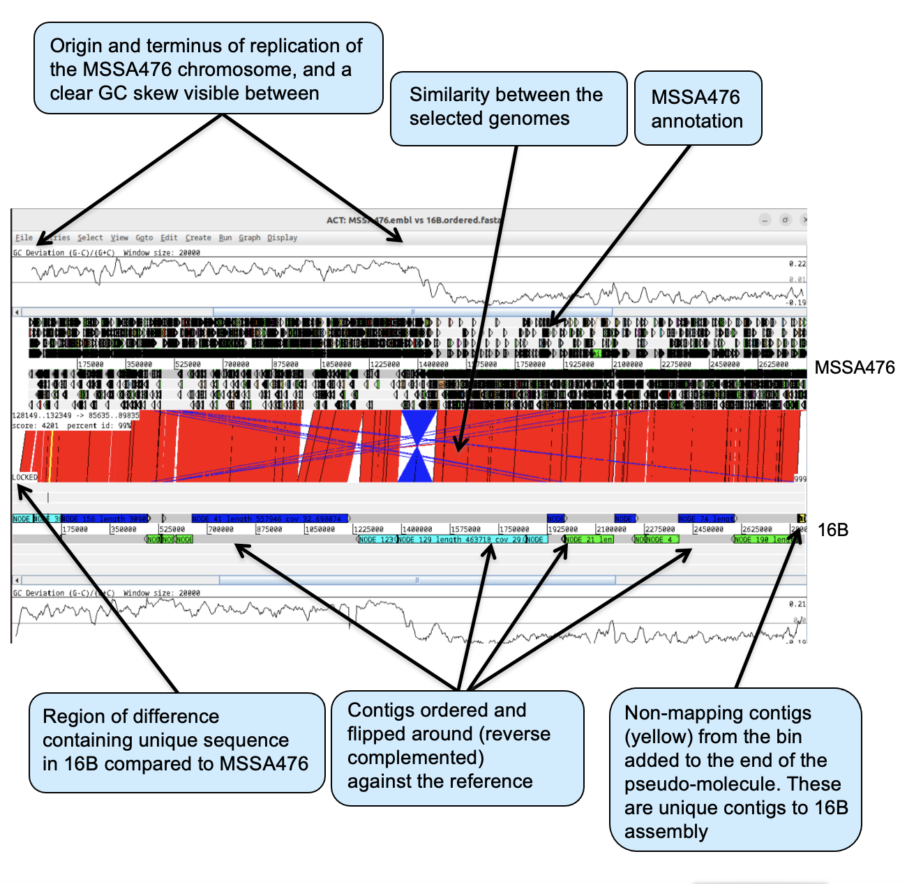
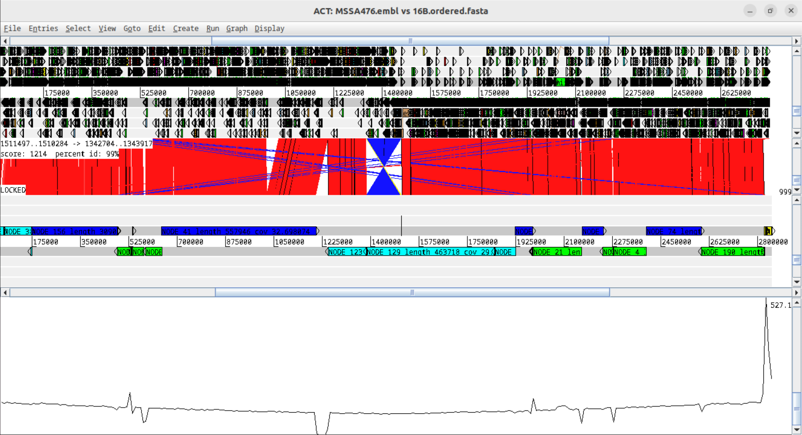
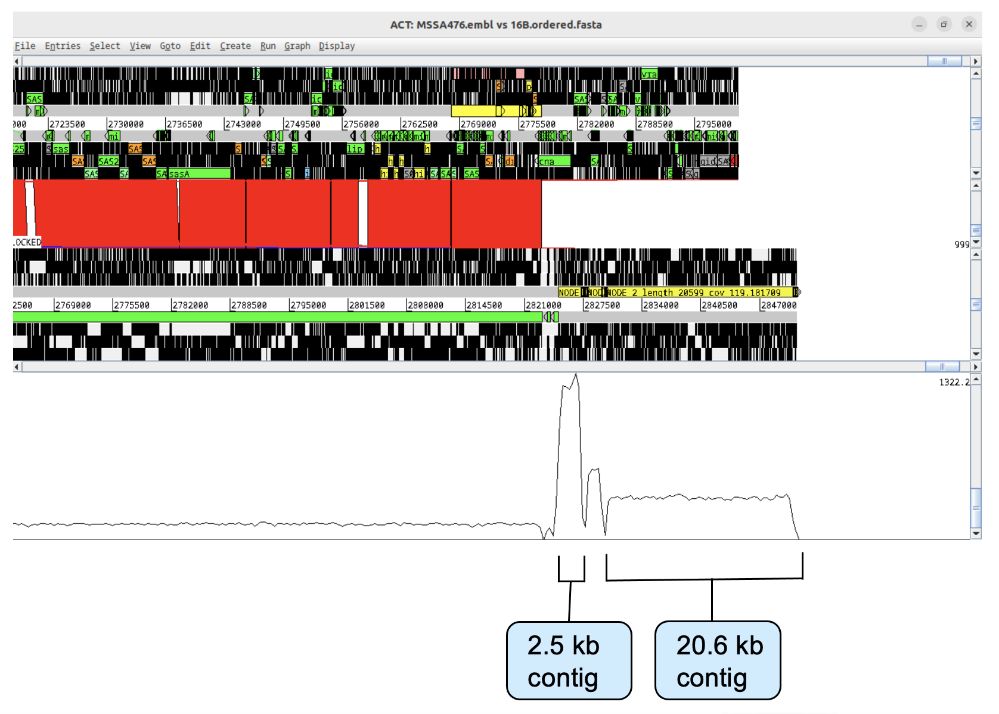
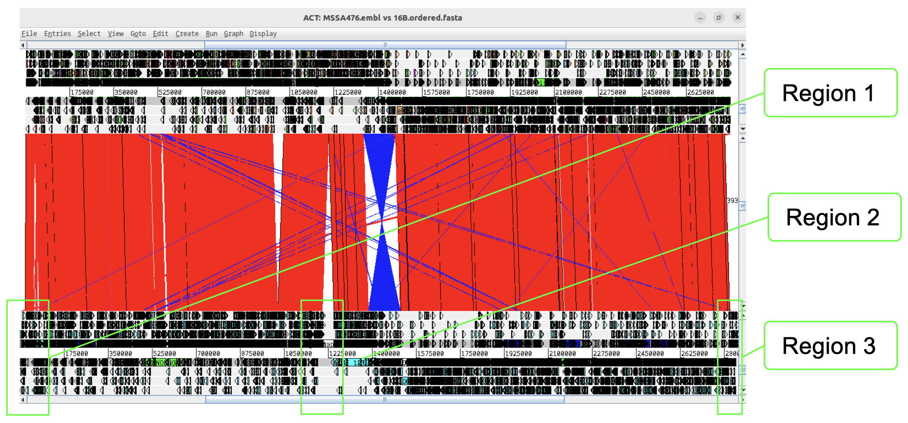
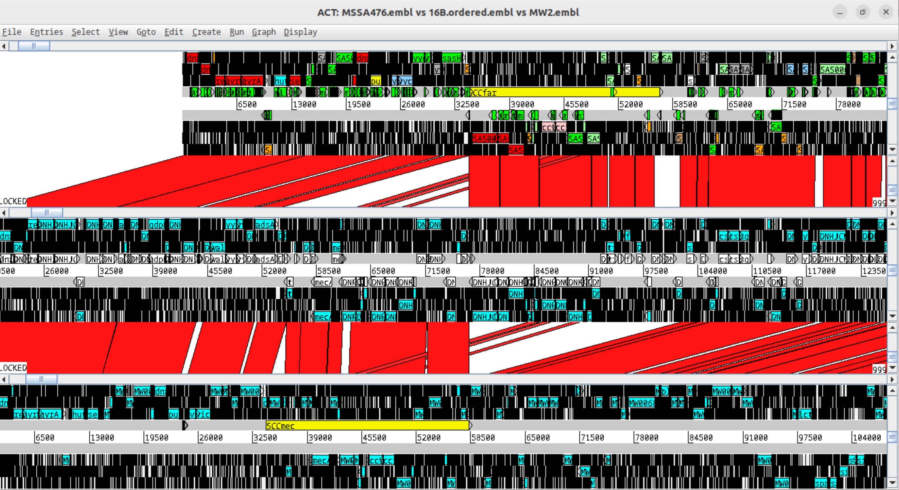

[<<< Go back to Manual Contents Page](https://github.com/WCSCourses/GenEpiLAC2023/blob/main/Manuals/README.md)

<br>

# Genome Assembly and Analysis - Paraguay 2023 <!-- omit in toc -->

### Module Leads: Matt Holden and Mat Beale<!-- omit in toc -->
<br>

# Table of contents <!-- omit in toc -->
- [Module Overview and Aims](#module-overview-and-aims)
- [Introduction](#introduction)
  - [Short-read sequencing assembly](#short-read-sequencing-assembly)
  - [Long-read sequencing assembly](#long-read-sequencing-assembly)
  - [Hybrid Assembly](#hybrid-Assembly)
  - [What assemblies are best?](#what-assemblies-are-best?)
- [Assembly and annotation exercise](#assembly-and-annotation-exercise)
  - [Background](#background)
  - [An outbreak sample](#an-outbreak-sample)
  - [Analyses](#analyses)
  - [The research questions](#the-research-questions)
  - [Examining the resistome of 16B](#examining-the-resistome-of-16B)
  - [Generating a _de novo_ assembly](#generating-a-de-novo-assembly)
  - [Ordering the assembly against a reference chromosome](#ordering-the-assembly-against-a-reference-chromosome)
  - [Mapping reads back to the ordered assembly](#Mapping-reads-back-to-the-ordered-assembly)
  - [Generating Annotation](#generating-annotation)
  - [Examining the evolution of drug resistance in ST1 _S. aureus_](#Examining-the-evolution-of-drug-resistance-in-ST1-S-aureus)

<br> 

# Module Overview and Aims

<br>

One of the greatest challenges of sequencing a genome is determining how to arrange sequencing reads into chromosomes and plasmids. This process of determining how the reads fit together by looking for overlaps between them is called genome assembly. In this module we are going to look as assemblies using short- and long-reads and see how they can be used to characterize isolates of interest, and when annotated, help answer biological and clinical questions.

Aims of this exercise

*	Use a resistome prediction tool to identify the genetic determinants for antibiotic resistance from sequencing reads
*	To show how short-read data can be assembled into a draft genome
*	Order the draft genome against a reference sequence
*	Annotate the reordered draft genome
*	To show how, using comparative genomics, regions of difference that distinguish genomes can identified and analysed
*	Identify the genetic basis of resistance and be able to explain the evolution of resistance in the isolates investigated 

<br>

# [Introduction](#introduction)

<br>

## [Short-read sequencing assembly](#short-read-sequencing-assembly)

<br>

The data from the Illumina machine comes as relatively short stretches (35-250 bp) of DNA – around 6 billion of them for a typical bacterial genome. These individual sequences are called sequencing reads. There are a range of assembly programs that have been specifically designed to assemble genomes from next generation sequence (NGS) data. Genome assembly using sequence reads of around 100bp is complicated due to the high frequency of repeats longer than the sequence read length in genomes, for example: insertion sequence (IS) elements, rRNA operons; and the massive amount of data the programs have to handle. In addition to finding overlaps in the sequence, the assembly programs can also use information from the predicted insert size where paired reads are used, to link and position reads in an assembly.

Where a genome is piecing together without any reference sequence to compare it to, or scaffold it against, it is termed a _de novo_ assembly. Due to the previously mentioned challenges of assembly, de novo assembly using short reads will not produce complete genomes, but will be fragmented into multiple contiguous sequences (contigs), the order of which is arbitrary, and does not necessarily bear not any relation to their real order in the genome. 


## [Long-read sequencing assembly](#long-read-sequencing-assembly)

<br>

With the availability of real-time sequencing technologies, such as Oxford Nanopore and Pacific Bioscience, it is possible to generate sequence reads that far exceed the size of those produced by Illumina platforms. The size of read can be tens of thousands of base pairs in length, contrasting with the tens or hundreds of base pairs generated by Illumina, which had led to these technologies being term long-read technologies.

Having longer reads, that extend through some of the repeat regions that limit the assembly of short-read sequence data, can help piece together a genome sequence. However due to the higher error rate of some real-time sequencing technologies and the variable distribution of size of reads they generate, mean that generating high quality complete assemblies from long-reads alone can challenging.

## [Hybrid Assembly](#hybrid-Assembly)

<br>

A popular approach to generate complete genomes has been to utilize the accuracy of short-read sequencing data and combine it with the long-range information of long-read sequencing data, in a hybrid assembly approach. This requires sequence data for an isolate to be sequenced using the two different sequencing technologies. This can then be assembled using assembler programs that are designed to handle the difference types of data and compare them to find overlaps to stitch the sequences together and accurately predict the sequence in the assembly.

## [What assemblies are best?](#what-assemblies-are-best?)

<br>
Hybrid assemblies that are more complete have advantages for downstream analysis, however require access to sequencing capacity for two different technologies, and incur the extra expense of sequencing the same isolate twice, consequently it is not always practical to use this approach to characterize isolates of interest. Equally, it is not always necessary to generate more complete assemblies if the information you need from the genome is not dependant on knowing the full genomic context, i.e. genotyping and isolate for an biomarker such as an antibiotic gene. To answer the question of what is the best assembly to aim for, it very much depends on what you want to use it for. 

<br>

# [Assembly and annotation exercise](#assembly-and-annotation-exercise)

<br>

## [Background](#background)

<br> 

_Staphylococcus aureus_ is a bacterial pathogen that has gained notoriety in recent years due to its ability to evolve new virulent and drug resistant variants. In particular, the spread of _S. aureus_ in hospitals has placed an increased burden on health care systems; _S. aureus_ is the most common cause of hospital-acquired infection. Accompanying the spread of this bacterium has been an increase in the resistance to antibiotics. In parts of Europe, the US and Japan, 40-60% of all hospital _S. aureus_ are now resistant to the β-lactam antibiotic methicillin. Methicillin-resistant _S. aureus_ (MRSA) strains were first described in the 1960s and successful clones of MRSAs have spread round the globe.

## [An outbreak sample](#an-outbreak-sample)

<br>

In this module we will assemble the genome of a strain of _S. aureus_, 16B, that was sequenced as part of an MRSA outbreak investigation, (Köser _et al_., 2012, N Engl J Med. 366:2267-75). Using multi locus sequence typing (MLST) the isolate was identified as belonging to sequence type 1 (ST1), a lineage of _S. aureus_ that is more frequently associated with infections in the community rather than in hospitals, and tends to be less resistant to antibiotics than the _S. aureus_ commonly associated with hospital-acquired infection.

## [Analyses](#analyses)

<br>

We are going to query the resistome of 16B using `ariba` and a resistance gene database. We will generate an assembly and compare it to the chromosomes of 2 other ST1 isolates: MSSA476, which was isolated in the UK (Holden _et al_., 2004, PNAS. 101:9786-91), and MW2, which was isolated in the USA (Baba _et al_., 2002, Lancet 359:1819-27). Both MSSA476 and MW2 have been completely sequenced, annotated and deposited in EMBL.

<br>


<br>


## [The research questions](#the-research-questions)

<br>

The three ST1 isolates are closely related but exhibit different antibiotic resistance profiles: 16B is resistant to penicillin, fusidic acid, methicillin and erythromycin; MSSA476 is resistant to penicillin and fusidic acid; and MW2 is resistant to penicillin and methicillin. 

Using a comparative genomic approach we will identify regions of difference, and identify the genetic basis of the antibiotic resistance in 16B, and genetic mechanisms that drive the evolution of resistance.

<br>


## Finding the data 
Navigate to the `Module_6_Genome_Assembly_Analysis` directory

```
cd Module_6_Genome_Assembly_Analysis
```

We can confirm where we are 
```
pwd
```

We can also examine the contents of this file
```
ls -l
```


<br>

The folder contains:

- three pairs of sequencing reads :
  - `16B_1.fastq`, `16B_2.fastq`
  - `MSSA476_1.fastq`, `MSSA476_2.fastq`
  - `MW2_1.fastq`, `MW2_2.fastq`
- fasta format files for the chromosomes of MW2 and MSSA476 (`MW2.dna` and `MSSA476.dna`)
- EMBL format files of the annotation of the chromosomes of MW2 and MSSA476 (`MW2.embl` and `MSSA476.embl`) 
- EMBL format files of mobile genetic elements of the chromosomes of MW2 and MSSA476 (`MW2_MGEs.tab` and `MSSA476_MGEs.tab`) 
- a folder containing the pdf files of the Köser _et al_., Holden _et al_., and Baba _et al_. manuscripts if you want to find out a bit more about the genomes and origins of the isolates
- a folder containing an annotation database


<br>


## [Examining the resistome of 16B](#examining-the-resistome-of-16B)


### Using the genome to predict antibiotic resistance phenotype

One of the benefits of whole genome sequencing bacterial pathogens is that you capture the genomic inventory of the organism. This has been capitalized on in clinical microbiology for the _in silico_ prediction of antibiotic resistance directly from whole genome sequencing data. This is being developed as a alternative to phenotypic sensitivity testing of microorganisms in the laboratory, where microorganisms are routinely sequenced.

For many microorganisms the genetic basis of antibiotic resistance has been extensively studied. This means that the genes responsible for resistance have been identified and sequenced, and can be used to compile a database of resistance determinants and used to query an organism’s genome and define its resistome. Based on the presence or absence of genes or mutations it is possible to make a prediction of the antibiotic sensitives of an organism. For some species of bacteria this works better than others. For example, _S. aureus_ the correlation between the genotype and phenotype for most commonly used antibiotics is above 99%. However, for other organisms, such as members of the _Enterobacteriaceae_, the concordance is a lot lower, as these organisms have a more extensive array of resistance mechanisms and determinants.

A recent review from a EUCAST subcommittee summarized the current development status of WGS for bacterial antimicrobial susceptibility testing (AST) for a range or organisms: Ellington MJ, _et al_., (2017) The role of whole genome sequencing in antimicrobial susceptibility testing of bacteria: report from the EUCAST Subcommittee. Clin Microbiol Infect. 23:2-22. PubMed PMID: 27890457.


### Resistance phenotype of 16B

From the phenotypic data you have been given you know that 16B exhibits resistance to penicillin, fusidic acid, methicillin and erythromycin, however you do not know what genes are responsible for this is in this isolate. In the first part of this exercise you are going to use a piece of software, `ariba`, and a publicly available curated antibiotic resistance gene database from ResFinder, to rapidly predict the resistome of 16B from the Illumina sequence reads. You will also do this for this other ST1 _S. aureus_ isolates MW2 and MSSA476, and correlate the phenotypic metadata with the genetic information.


### Determining the antibiotic resistance genotype

`ariba` (Antimicrobial Resistance Identifier by Assembly) is a freely available tool (https://github.com/sanger-pathogens/ariba). This tool required a `FASTA` input of reference sequences, which can be a multifasta file or database of antibiotic resistance genes or non-coding sequences. This database will serve as one of your inputs and the other is paired sequence reads. `ariba` reports which of the reference sequences were found, plus detailed information on the quality of the assemblies and any variants between the sequencing reads and the reference sequences. 

`ResFinder`, is a web resource for the prediction of antibiotic resistances (www.genomicepidemiology.org). It uses a curated database of over 2100 acquired antibiotic resistance determinants (Zankari E _et al_., (2012) Identification of acquired antimicrobial resistance genes. J Antimicrob Chemother. 67:2640-4).

We have installed `ariba` on the virtual machine, and you will use this to download the `ResFinder` database locally to the virtual machine, and then use it with `ariba` to examine the resistome of your isolates. Further information about `ariba` can be found here: https://github.com/sanger-pathogens/ariba/wiki (Hunt M, _et al_., (2017) `ariba`: rapid antimicrobial resistance genotyping directly from sequencing reads. Microb Genom. 3:e000131) 

The results can then be viewed in `Phandango` (http://jameshadfield.github.io/phandango/), an interactive web tool to visualize your outputs.

<br>

The first part of this exercise will follow 6 steps:

Step 1. Download the ResFinder database using `ariba` and format it
Step 2. Run `ariba` on the 16B fastq reads
Step 3. Run `ariba` on the MW2 fastq reads
Step 4. Run `ariba` on the MSSA476 fastq reads
Step 5. Compile the results from 16B, MW2 and MSSA476
Step 6. Visualize output in Phandango

<br>

## [Step 1: Download the `ResFinder` database](#Download-the-resfinder-database) 

To download the database you use the `ariba` `getref` command. 

In the command below we:

- Specify the database to download
    - `resfinder`
- Specify the output name prefix
    - `out.resfinder`


```
ariba getref resfinder out.resfinder
```


Alternative database options that can be used are: argannot, card, megares, plasmidfinder, resfinder, srst2_argannot, vfdb_core, vfdb_full, virulencefinder.

<br>


Next you need to format the reference database using the `ariba` `prepareref` command. 

In the command below we:

- Specify the file of resistance genes in fasta format
    - `–f out.resfinder.fa`
- Specify the metadata file for the resistance genes
    - `–m out.resfinder.tsv`
- Specify directory that will contained the prepared database files for running `ariba`
    - `out.resfinder.prepareref`


```
ariba prepareref -f out.resfinder.fa -m out.resfinder.tsv out.resfinder.prepareref 
```

<br>

## [Step 2: Run `ariba` on 16B](#run-ariba-on-16B)

Next using the 16B fastq files run local assemblies and call variants using the `ariba` `run` command. 

- Specify the directory containing the ResFinder database files
    - `out.resfinder.prepareref`
- Specify the 16B forward and reverse fastq files
    - `16B_1.fastq 16B_2.fastq`
- Specify the the directory containing the results
    - `16B_out.run`


```
ariba run out.resfinder.prepareref 16B_1.fastq 16B_2.fastq 16B_out.run
```

<br>

## [Step 3: Run `ariba` on MW2](#run-ariba-on-MW2)

Repeat the `ariba` run on the MW2 fastq files. 


- Specify the directory containing the ResFinder database files
    - `out.resfinder.prepareref`
- Specify the 16B forward and reverse fastq files
    - `MW2_1.fastq MW2_2.fastq`
- Specify the the directory containing the results
    - `MW2_out.run`


```
ariba run out.resfinder.prepareref MW2_1.fastq MW2_2.fastq MW2_out.run
```

<br>

## [Step 3: Run `ariba` on MSSA476](#run-ariba-on-MSSA476)

Repeat the `ariba` run on the MSSA476 fastq files.

- Specify the directory containing the ResFinder database files
    - `out.resfinder.prepareref`
- Specify the 16B forward and reverse fastq files
    - `MSSA476_1.fastq MSSA476_2.fastq`
- Specify the the directory containing the results
    - `MSSA476_out.run`


```
ariba run out.resfinder.prepareref MSSA476_1.fastq MSSA476_2.fastq MSSA476_out.run
```

<br>

## [Step 5: Compile the `ariba` results](#compile-the-ariba-results)

Next you need to compile the `ariba` results from the three isolates using the the `ariba` `summary` command.

- Specify the prefix for the output files
    - `out.summary`
- Specify the report files made by the separate runs of `ariba` for each isolate 
    - `16B_out.run/report.tsv MW2_out.run/report.tsv MSSA476_out.run/report.tsv`


```
ariba summary out.summary 16B_out.run/report.tsv MW2_out.run/report.tsv MSSA476_out.run/report.tsv
```

<br>

## [Step 6. Visualize in Phandango](#visualize-in-phandango)

The `ariba` summary command generates three files:

- `out.summary.csv` - summary of identifying genes and matches in the isolates 
- `out.summary.phandango.csv` - a version of summary file for viewing in Phandango
- `out.summary.phandango.tre` - tree based on matches in the out.summary.csv file


To visualize the results open up the Firefox web browser, and type in the URL: https://jameshadfield.github.io/phandango/

From a file view window drag and drop the two `phandango` files, `out.summary.phandango.tre` and `out.summary.phandango.csv`, into the browser window.


In the browser window the tree is displayed on the left and represents relationships of the isolates based on the shared resistance determinants displayed in the right-hand panel, where the column indicate genes, and the green blocks indicate matches. The pink blocks indicate that the isolates are negative for those genes.


<br>

## Questions

- What are the genes identified, and which antibiotics do they encode resistance for?

To help you understand what what genes ResFinder is using for different antibiotics you can explore here: https://cge.food.dtu.dk/services/ResFinder/gene_overview.php

- How do the resistomes predicted for each isolate compare with the phenotypic data?


<br>

## [Generating a _de novo_ assembly](#generating-a-de-novo-assembly)

Having identified antibiotic resistance genes using `ariba`, you are now going to continue the exercise exploring the genome of 16B to identify the genomic context of the genes and see if you can find any missing genes. The first step is to generate a _de novo_ assembly of 16B using the `fastq` files. Make sure you are still in the Module 6 directory.  

To generate the _de novo_ assembly you are going to use a assembly package called `velvet` (Zurbino et al., 2008, Genome Res. 8:821-9); other assembly programs are available, e.g. spades (https://github.com/ablab/spades), which we will use in a later exercise. `velvet` was one of the earlier assembly programs and takes in short read sequences, removes errors then produces high quality unique contigs. It then uses paired-end read and long read information, when available, to retrieve the repeated areas between contigs. 

The algorithm at the heart of Velvet is based on de Bruijn graphs (a mathematical structure used to model relationships between objects). When doing assembly with short reads the first step is to find all the possible overlaps between all the reads. One efficient way is to look for k-mers (words/nucleotide patterns of a specific length) in each read. If two reads contain the same k-mer they might also overlap. Each read contains several k-mers, and k-mers from the same read can be connected in a graph. Velvet represents overlaps between k-mers in a de Bruijn graph. By simplifying the graph Velvet can try to generate connected sequences, where k-mers in the graph are connected and thereby it is able to piece together sequences and generate contigs. 

In this module we are not going to explore the options available in Velvet, but are going to run it with basic parameters. If you would like to know more about theory behind Velvet, or the various options, see the Velvet web site (https://github.com/dzerbino/velvet).


<br> 

To perform the assembly you are going to run a series of commands that you will type on the command line. Make sure that you type the commands carefully as UNIX is case sensitive and there were lots text in some of the command lines.

The input files for the velvet de novo assembly are the `16B_1.fastq` and `16B_2.fastq` files that you previously used in with `aria`.

The forward and reverse reads for the isolate 16B were generated using an Illumina HiSeq machine and are 75bp paired-end reads. 

The `velvet` package contains two programs: `velveth` and `velvetg`, which are run in succession to generate the assembly. `velveth` helps you construct the dataset for the following program, `velvetg`, and indicates to the system what each sequence file represents. `velvetg` is the core of `velvet` where the de Bruijn graph is built then manipulated, and which ultimately produces the assembly that we are interested in.

<br>


The first program of the velvet package we are going to use is `velveth`.


- Specify the directory into which results are written
    - `S_aureus_16B.49`
- Specify the is the the k-mer value we are using (i.e. 49 nucleotides)
    - `49`
- Specify the the input files are short paired reads 
    - `-shortPaired`
- Specify the forward and reverse fastq files
    - `-fastq -separate 16B_1.fastq 16B_2.fastq`

Other k-mers can be used and can alter the performance of assembly, however for this module we will run it with a value of 49 which will perform adequately.


```
velveth S_aureus_16B.49 49 -shortPaired -fastq -separate 16B_1.fastq 16B_2.fastq
```





<br>


The next program of the velvet package we are going to use is `velvetg`.


- Specify the directory in which `velvetg` can find the `velveth` output files which are necessary to run `velvetg`: Sequences and Roadmaps files
    - `S_aureus_16B.49`
- Specify the program to infer the expected coverage of unique regions
    - `-exp_cov auto`
- Specify the minimum contig length of 200 bp exported to the output file
    - `-min_contig_lgth 200`
- Specify the program to infer removal of low coverage nodes
    - `-cov_cutoff auto`
- Specify the expected distance between two paired-end reads in the short-read dataset: 350 bp
    - `-ins_length 350`


```
velvetg S_aureus_16B.49 -exp_cov auto -min_contig_lgth 200 -cov_cutoff auto -ins_length 350
```




<br>


There is a lot of output printed to the screen, but the most important is in the last line:
Final graph has 251 nodes and n50 of 225962, max 557946, total 2777486, using 3846837/4000000 reads. (Result might differ depending on the velvet version used).

This line first gives you a quick idea of the result. 251 nodes (contigs) are in the final graph. An n50 of 225962 means that 50% of the assembly is in contigs of at least 225963 bases. This n50 parameter is most commonly used as an indicator of assembly quality. The higher, the better! max is the length of the longest contig. total is the size of the assembly, here it is 2.78 Mb. The last two numbers tell us how many reads were used from the 4 million pairs.

A typical S. aureus genome is 2.8 Mb in size, therefore the _de novo_ assembly that we have produced should contain over 99% of this isolate’s genome.

All of the results are written into the directory you specified, e.g. `S_aureus_16B.49` 

Use the UNIX `cd` command to move into this directory, and the `ls` command to look at the contents.





The final contigs are in `contigs.fa`. This files contains the contigs in multifasta format, i.e. the sequence of each contig is written as a separate fasta sequence, with all the contigs fasta sequences concatenated together. The `stats.txt` file holds some information about each contig, its length, the coverage, etc.. The other files contain information for the assembler.


<br>

We are now going to look at the assembly in `artemis`.

Type `art &` on the command line of your terminal window and press return. Once you see the initial Artemis window, open the `contigs.fa` file 
via *File*, *Open*.

Once open, zoom out so you can see the whole sequence in your window. The individual contigs in the multifasta file are alternately coloured orange and brown and displayed on he forward DNA line in the sequence view window. To look at a summary of the contigs.fa, click View, then Overview. You should see that there are 35 contigs in total (35 Number of features in active entry).





From the *Graph* menu, open *GC Deviation (G-C)/(G+C)* by clicking on the button next to it.

Rescale the plot for to a more appropriate window size for this zoomed out view: Right click on the graph, and click *Maximum Window Size*, and select *20000*. Then move the graph slider of the right hand side of the screen down to the bottom of the bar.


From the graph you can see that plot generally varies about an upper level and a lower level across the assembly, with shifts occurring at contig boundaries. As you will see there is a GC skew across the chromosome that is caused by a mutation basis that means that the leading strand of the replication fork is G and T rich, as opposed to the lagging strand, which is C and A rich. If you look at the circular diagram of MSSA476 earlier in the module, you can see the GC skew for the MSSA476 chromosome (the purple and olive inner plot on the figure). The origin and the terminus of replications are approximately half way round the chromosome (the origin is at the top, and the terminus is at the bottom), therefore there is a strong signal of GC deviation between these sites, i.e. as you move round the chromosome the GC Deviation plot will be either be at a high or low level, and after the origin or terminus of replication, the plot will shift to converse level. 

Looking at the GC Deviation plot in `artemis` of the 16B assembly you can see there are multiple shifts from high to low indicating that the contigs in the assembly as displayed, are not in the correct order and orientation relative to the true origin and terminus of replication of the 16B chromosome.


<br>


## [Ordering the assembly against a reference chromosome](#ordering-the-assembly-against-a-reference-chromosome)

At the Wellcome Sanger Institute a tool called `abacas` (Assefa _et al_., 2009) was developed to order contigs against a reference sequence. Any spaces between the contigs (gaps) can be filled in with “N” characters to ‘pad’ the sequence with equivalent sized regions to those on the reference that may be missing in the assembly. The result is called a pseudo-molecule. This can be loaded into `act` along with the reference sequence and then be analyzed.

The sequence we are going to use as a reference belongs to an ST1 MSSA strain, MSSA476 (EMBL accession number BX571857). Before we begin, make sure you are back in the Module 6 directory.

<br>


To check where you are use the UNIX `pwd` command. If you were in in the `S_aureus.49` directory, use the `cd ..` command to move into the directory above.

We are going to reorder the 16B assembly against the MSSA476 reference using `abacas`


- Specify the abacas script 
    - `abacas.1.3.1.pl`
- Specify the reference sequence in a single fasta file
    - `-r MSSA476.dna`
- Specify the contigs in multi-fasta format (contig.fa in S_aureus_16B.49 directory)
    - `–q S_aureus_16B.49/contigs.fa`
- Specify the MUMmer program to use: nucmer (nucleotide-nucleotide comparison)
    - ``
- Specify the default nucmer parameters, which is in this case is faster
    - `-d`
- Specify the program to generate a bin of contigs that don’t map. This is very important
    - `-b`
- Specify the program to append contigs in bin to the pseudo-molecule
    - `-a`
- Specify the prefix for the output file name
    - `–o 16B.ordered`

To see a complete list the option available you can type the command: `abacas.1.3.1.pl -h`


```
abacas.1.3.1.pl -r MSSA476.dna -q S_aureus_16B.49/contigs.fa -p nucmer -b -d -a -c -o 16B.ordered
```

<br>


Once `abacas` is done, we are going to use `act` to look at the new ordered contigs.


Before opening the files in `act`, we are need to generate a `blastn` comparison file, rather than using the comparison file that `abacas` generates. This is because the `abacas` generated file is based on MUMMER and just aligns the contigs and does not report smaller matches within contigs.

Previously we have used pre-generated comparison files for `act`. This time you are going to do it yourself using the locally installed version of `blast`. 

<br>


We will run two programs: `formatdb`, which formats one of the sequences as a `blast` database; and the other `blastall`, runs the `blast` comparison.


First we will run `formatdb`.


- Specify the sequence protein (True or False). Ours is DNA sequence therefore we use F
    - `-p F`
- Specify the input sequence to format
    - `i MSSA476.dna`


```
formatdb -p F -i MSSA476.dna
```


Next we will run `blastall`


- Specify the `blast` program to use
    - `-p blastn`
- Specify the alignment output type (8, one line per entry)
    - `-m 8`
- Specify the database file. This must be the file used for the `formatdb` command
    - `-d MSSA476.dna`
- Specify the query file
    - `-i 16B.ordered.fasta`
- Specify the output file name
    - `-o MSSA476.dna_vs_16B.ordered.fasta`


```
blastall -p blastn -m 8 -d MSSA476.dna -i 16B.ordered.fasta -o MSSA476.dna_vs_16B.ordered.fasta
```

<br>


We are now going to look at the `abacus` ordered 16B assembly in `act` with the `blastn` comparison file we have just generated.


At the prompt type and return the command line:


```
act MSSA476.embl MSSA476.dna_vs_16B.ordered.fasta 16B.ordered.fasta &
```


Once the `act` window loads up, open `16B.ordered.tab` file into the `16B.ordered.fasta` entry by going to the *File* menu, and selecting the *16B.ordered.fasta* option, and right clicking onto the *Read An Entry* option. 

Once ACT has opened, zoom out so you can see the whole of the sequences (you may have to re-size the ACT window) and reduce the size of the BLASTN footprint that is displayed, by moving the slider on the right-hand side of the comparison window down to the bottom of the bar.

As before, display the GC Deviation (G-C)/(G+C) plots for both of the sequences (under the Graph menu there will be two sequences, top and bottom sequences, click on each to open the graphs for each). Remember to rescale the plot for a more appropriate window size (use 20000 as before, then move the graph slider of the right hand side of the screen down to the bottom of the bar).





In the `act` figure there are several regions of interest that are worth investing. The first region we are going to look at is the inverted region in the centre of the assembly that is covered by the hourglass shaped blue matches in the comparison panel. This 130 kb region spans the terminus of replication region, and is present at one end of a contig. At the other end of the putative inverted region there is a contig break. 


<br>

## [Mapping reads back to the ordered assembly](#Mapping-reads-back-to-the-ordered-assembly)

In this next exercise you are going to use the same mapping method as you did in Mapping Module, to map the 16B strain forward and reverse reads against the pseudo-molecule that you created using `abacas`. We are then going to look at the aligned mapped reads in `act` by loading the mapped bam file with the `16B.ordered.fasta`.  


First we will run `snippy`.

- Specify the output directory
    - `--outdir 16B_mapping`
- Specify the forward read
    - `--R1 16B_1.fastq`
- Specify the reverse read
    - `--R2 16B_2.fastq`
- Specify the reference sequence to map to
    - `--ref 16B.ordered.fasta`
- Specify the number of cpus
    - `--cpus 4`
- Specify the amount of ram
    - `--ram 4`
- Specify overwriting existing file 
    - `--force`
- Specify no screen output 
    - `--quiet`


```
snippy --outdir 16B_mapping --R1 16B_1.fastq --R2 16B_2.fastq --ref 16B.ordered.fasta --cpus 4 --ram 4 --force --quiet
```


<br>

The bam file contains all the mapping positions on the genome for each individual read is in the `16B_mapping` directory.

Before we can use it in `act` we have to index is using the `samtools` `index` command.


- Specify the bam file to index
    - `16B_mapping/snps.bam`


```
samtools index 16B_mapping/snps.bam
```

<br>


To load the `bam` file into `act`, click *File* on the menu and them click the *16B.ordered.fasta* entry, and then the *Read BAM / VCF*.

In the pop-up box click *Select*, select the `snps.bam` file from the `16B_mapping` directory, click *Open*, then click *OK*.


<br>

If you are not already there, go to the inversion region, and the inversion point in the contig (the region below illustrated in the image). You should see the BAM view as a panel at the bottom of the screen.


Zoom in further keeping the inversion site in the centre of the ACT screen.  


The reads in the BAM view appear to break at the junction of the inversion indicated by the `blasts` match; no reads span the junction point (click on the reads around the junction to see their pair) suggesting that there may be problems with the assembly of the 16B DNA across this region. 

To get another perspective of the mapping to this region, change the BAM view to show the inferred size of the insert. To do this right click on the BAM view window, move the cursor over *Views*, and click *Inferred Size*.


From the inferred size view you can see that there are no reads with predicted inserts that span this region. This suggests that the inversion may not be present, and that the sequence generated by Velvet in this region has not assembled correctly, and needs further investigation. To check if this is a mis-assembly, you could change the parameters of the original Velvet runs, or alternatively design PCR primers and do a PCR to check for the orientation of this region in the genomic DNA.

<br>

In addition to allowing us to check for potential mis-assemblies we can also use the mapping data to look for copy number variants in the assembly.

In `act` change the read view back to *Stack view*, and zoom out to see the whole sequence





From this view in `act` you can see that the average coverage across the whole 16B sequence is about 120 fold, and that there is subtle reduction in coverage from the origin to the terminus of replication. You can also see that the non-mapping sequences from the bin at the right-hand side of the sequence have a higher level of coverage than the rest of the sequence that matches to the MSSA476 chromosome.

Zoom into this region to look in more detail.





The non-mapping contigs are indicated by the yellow features. There are 7 contigs and the two larger sequences are 20.6 kb and 2.5 kb. The read coverage across these regions increases considerably from the average (120 fold), to about 400 fold for the 20.6 kb contig, and 1400 fold for the 2.5 kb contig. It is therefore likely that these two contigs are separate multicopy plasmids that are part of the 16B genome.

<br>


## [Generating Annotation](#generating-annotation)

Now we have the contigs ordered against the reference, and have mapped back the reads to identify a possible mis-assembly, and also identified putative plasmid sequences. However we are still not yet in a position to drill down into the biology of the strain. For this we need to add some annotation to the newly assembled genome. 

There are a number of ways you can generate annotation for a novel sequence. You can manually annotate sequence by curating the results of bioinformatic analyses of the sequence, but this is time consuming and prone to human bias. If there is a closely related reference sequence and annotation, you can transfer annotation by similarity matching, but this relies on there being a suitable reference. The fastest and most consistant way to generate annotation for novel sequence is to use an automatic annotation software such as `prokka` (Seemann T. (2014) Prokka: rapid prokaryotic genome annotation. Bioinformatics. 30:2068-9. doi: 10.1093/bioinformatics/btu153) or `bakta` (Schwengers O et al., (2021). Bakta: rapid and standardized annotation of bacterial genomes via alignment-free sequence identification. Microbial Genomics, 7(11). https://doi.org/10.1099/mgen.0.000685)

Both of these program are installed on the disk image, but we are going to use `bakta` as this is a new tool that generates standardized, taxonomy-independent, high-throughput annotation.

There are two steps in running `bakta`, the first is downloading a database for it to use for annotation, the second is to run the `bakta` annotation on a query sequence using the database. The downloading step takes a while to run (it involves download a file of ~1.6 Gb), so we have already down loaded is for you. 


### Running `bakta`


To run `bakta` to annotate your sequence.

- Specify the database directory
    - `--db bakta_database/db-light`
- Specify the multifasta file to be annotated
    - `16B.ordered.fasta`


```
bakta --db bakta_database/db-light 16B.ordered.fasta
```

<br>


The first step of `bakta` is to annotate non-protein encoding regions including tRNAs, tmRNA, rRNA, ncRNA.


<br>


It then predicts protein coding sequences and annotates these from match to proteins with predicted function, and includes annotation of hypothetical proteins with matches to protein domains


<br>


Matches to plasmids origins of replication are included where found and provides a summary of the genomic annotation.


<br>


The results are written to multiple output files in the directory in which `bakta` was run.


<br>


For more information on the annotation generated by `bakta`, the run options and the output it generates see here: https://github.com/oschwengers/bakta   


### Visualizing the `bakta` annotation


`bakta` has generated a number of output files in different foramt that contain the annotation for 16B ordered assembly. We are going to use the EMBL format file and view it in ACT. 

In ACT, open the `16B.ordered.embl` file into the `16B.ordered.fasta` entry by going to the *File* menu, and selecting the *16B.ordered.fasta* option, and right clicking onto the *Read An Entry* option. 





<br>

### Region 1


In this region near at the left hand side of the reference chromosome and near the origin of replication, you can see that this contig spans the origin of replication and therefore matches two separate regions of the reference (left and right ends of the MSSA476 chromosome). 

Beyond the origin of replication there is a second region that is a novel indel region in 16B. The region spans two contigs. This ~22 kb region, contains `blastn` hits in the middle of the sequence, that match sequence in the MSSA476 reference (top) that is also present in the 16B assembly. This suggest that the ~22 kb region shares some similarity with the region downstream. 

- Have a look at the annotation generated by `bakta` of the CDSs in this region in 16B. 
- What sort of functions do the proteins in this region encode? 
- Have a look at the annotation of the CDSs in the MSSA476 reference that match this regions. 
- What do you the identity of this region is?
- Can you find any genes of interest for antibiotic resistance that `ariba` identified?
<br>


### Region 2


From the `act` figure it would appear that there is a large insert in the 16B assembly relative to the MSSA476. If you zoom in and look at the sequence you will see that is composed of Ns rather than bases (in the figure you can make out regions with Ns, as they do not have any black lines that indicate stop codons on the forward and reverse translations). In this case ABACAS has mis-predicted a gap in this region, and therefore `bakta` has not  annotation this region as it does not contain sequence.

<br>


### Region 3


In this region near at the right hand side of the assembly, we have the non-mapping contigs (yellow). Previously we have seen that the two largest contigs are likely to be separate plasmids. 

- Have a look at the annotation generated by `bakta` of the CDSs of the contigs in this region. 
- What sort of functions do the proteins in this encode? 
- Does the annotation confirm them as plasmids?
- Can you find any genes of interest for antibiotic resistance that `ariba` identified?


<br>


## [Examining the evolution of drug resistance in ST1 _S. aureus_](#Examining-the-evolution-of-drug-resistance-in-ST1-S-aureus)


Up until now we have compared the 16B assembly to only one other ST1 _S. aureus_ strain, MSSA476. We are now going introduce another strain to the comparison, MW2, and start looking at the genetic differences between the isolates that may impact on their biology. Although MW2 was isolated in a different country (USA), many thousands of miles away from 16B and MSSA476 (both UK), it still belongs to the same clone, and probably share a common ancestor tens rather than hundreds of years ago. A clinically important phenotypic difference between these isolates are their antibiotic resistances:

- 16B – penicillin<sup>R</sup>, fusidic acid<sup>R</sup>, methicillin<sup>R</sup>, erythromycin<sup>R</sup>
- MSSA476 – penicillin<sup>R</sup>, fusidic acid<sup>R</sup>
- MW2 – penicillin<sup>R</sup>, methicillin<sup>R</sup>

As you will hopefully have just discovered, it is possible to use genome sequence data to find the genes responsible for antibiotic resistance. Examining the genetic context of these genes helps us to understand the mechanism that are driving the evolution of resistance in these _S. aureus_ isolates. In this next part of the Module you are going use the comparisons with MW2 and MSSA476 to identify regions of difference regions that distinguish the isolates, and explain the differences in the antibiotic resistance phenotypes.

<br>

Before we begin this exercise close down any `act` session you have open.

In order to examine the regions of difference in the 16B assembly with MW2 we are going generate a comparison file that we can load in ACT, as we did previously for MSSA476.

At the prompt type and return the command line:

```
formatdb -p F -i 16B.ordered.fasta
```


Next type and return the command line:

```
blastall -p blastn -m 8 -d 16B.ordered.fasta -i MW2.dna -o 16B.ordered.fasta_vs_MW2.dna
```


We are now going to load up the three sequences and relevant comparison files into `act`. You can do this either from the command line or by clicking on the ACT icon. 


If you prefer to do it from the command line you can type:

```
act MSSA476.embl MSSA476.dna_vs_16B.ordered.fasta 16B.ordered.embl 16B.ordered.fasta_vs_MW2.dna MW2.embl &
```

<br>


Now that you have included the MW2 sequence to the comparison you should see an `act` view with three DNA panels and two comparison panels separating them. In this zoomed out view, MSSA476 is on the top, 16B is in the middle and MW2 on the bottom. You will also notice that in the `act` menu at the top there are now three entry options. 


To help you with your investigations, we have also provided two additional annotation files that contain misc_features which mark the extent of MGEs identified in the MSSA476 and MW2 chromosomes. These can be loaded into the appropriate entry (from the menu click *File*, the entry you want, then *Read An Entry*). The misc_features are colour coded in the ACT view according to the type of MGE (see legend on on the circular diagram of MSSA476).


Here is the Region 1 that we have looked at previously, now with MW2 at the bottom. The regions of 16B that lacking annotation transferred from MSSA476, contains a matches to a region of the MW2. Does the identity of this MW2 region correspond to what you have seen from the NCBI BLAST searches? What has occurred in this region of the 16B chromosome that could explain the structure of this region in comparison to the other strains?





Compare the other regions containing MGEs. 

- How do these regions vary in the three strains, and what do they encode? 
- Does this explain the differences in the antibiotics phenotypes of the isolates? 
- Can you find any other important genes associated with MGEs that are vary in the isolates that are clinical relevant (clue, think toxins).


<br>

<br>

[>>> Go to Assembly Method Comparison Exercise](https://github.com/WCSCourses/GenEpiLAC2023/blob/main/Manuals/Assembly_method_comparison/Assembly_method_comparison.md)

[<<< Go back to Manual Contents Page](https://github.com/WCSCourses/GenEpiLAC2023/blob/main/Manuals/README.md)

<br>

