[<<< Go back to Manual Contents Page](https://github.com/WCSCourses/GenEpiLAC2023/blob/main/Manuals/README.md)

<br>

# Assembly Method Comparisons - Paraguay 2023 <!-- omit in toc -->

### Module Leads: Matt Holden & Mat Beale <!-- omit in toc -->
<br>

    
# Table of contents <!-- omit in toc -->
 - [Module Overview and Aims](#module-overview-and-aims)
 - [Exercise](#exercise)
 - [Assembly Methods](#assembly-methods)
 - [Assessing Assembly Quality](#assessing-assembly-quality)


<br>

# Module Overview and Aims

Mapping reads to a reference genome can impose biases, as this approach does not allow inclusion of genomic regions (or genes) present in the genome of interest but absent from the reference. An alternative method is _de novo_ assembly. _De novo_ assembly can make use of "short" (Illumina) or "long" (ONT/PacBio) sequencing reads, or even both ("Hybrid"), and there are various tools available for the different types of assembly. 

This exercise acts as a supplement to the main Assembly module, and aims to demonstrate the effect of using different tools and datatypes on bacterial assemblies. We will use Illumina and Oxford Nanopore data from a single _Staphylococcus aureus_ genomes and compare the outputs of different assembly tools and approaches. 

<br>


# Exercise

Since each assembler can take a while to run, each student will pick a different approach to start with, and we will then compare the outputs as a group. We will also evaluate the effect of using a different number of long reads:

 - Illumina short reads (paired end)

 - Oxford Nanopore long reads
    - 10,000 reads
    - 5,000 reads
    - 2,500 reads


First move into the working directory for this exercise:
```
cd Module_6_Assembly_Comparison_exercise
```
You can examine the contents of this directory:
```
ls -lh
```


<br>


In this directory, you should have 6 main files:
 - Illumina short reads (forward and reverse)
    - `S_aureus_JKD6159_Illumina.ds500000-reads_1.fastq.gz`
    - `S_aureus_JKD6159_Illumina.ds500000-reads_2.fastq.gz`
 - Oxford Nanopore long reads (3 different versions at 10,000, 5,000 and 2,500 reads)
    - `S_aureus_JKD6159_ONT_R10.4_guppy_v6.1.7__filt.ds10000.fastq.gz`
    - `S_aureus_JKD6159_ONT_R10.4_guppy_v6.1.7__filt.ds5000.fastq.gz`
    - `S_aureus_JKD6159_ONT_R10.4_guppy_v6.1.7__filt.ds2500.fastq.gz`
 - A Reference genome (for this particular sample) for comparison with our new assemblies
    - `S_aureus_JKD6159.fasta`


<br>

<br>

# Assembly Methods

## Short read only assembly (Unicycler)
For assembly of short (Illumina) reads, we will use `Unicycler`. With short read data, `Unicycler` acts as wrapper script for the `SPAdes` assembler, and will produce an assembly with settings optimised for bacteria. 

<br>

In the command below we:

- Allocate 4 CPUs to the assembler 
    - `-t 4`
- Specify the Illumina forward and reverse reads to use 
    - `-1 <fastq>` and `-2 <fastq>`
- Specify a directory to output files to
    - `-o <dir>`


```
unicycler -t 4 -1 S_aureus_JKD6159_Illumina.ds500000-reads_1.fastq.gz -2 S_aureus_JKD6159_Illumina.ds500000-reads_2.fastq.gz -o S_aureus_JKD6159.unicycler.short
```

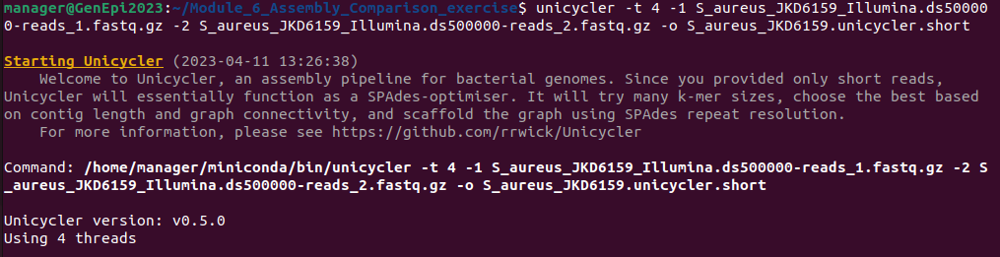

<br>

## Long read only assembly (Unicycler)
For assembly of long reads, `Unicycler` switches to the long read assembler `miniasm` - this is a very rapid assembler, but is not particularly accurate, and can often introduce errors and mistakes into its outputs.

<br>

In the command below we:

- Allocate 4 CPUs to the assembler 
    - `-t 4`
- Specify the ONT long reads to use
    - `-l <fastq>`
- Specify a directory to output files to
    - `-o <dir>`

```
unicycler -t 4 -l S_aureus_JKD6159_ONT_R10.4_guppy_v6.1.7__filt.ds10000.fastq.gz -o S_aureus_JKD6159.unicycler.long
```

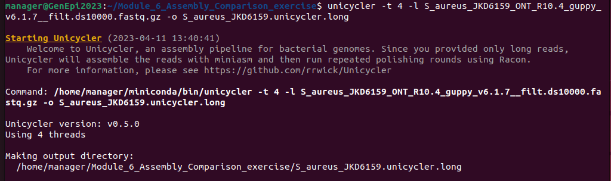


<br>

## Hybrid assembly (Unicycler)
For assembly of both long and short reads, `Unicycler` uses `SPAdes` for an initial 'short read' assembly, and then uses the long reads to attempt to bridge the gaps between contigs from the initial `SPAdes` assembly. This can work well when the short read data is of high quality/depth but the ONT data is of low depth. However, the 'bridging step' can be time consuming, and if the short read assembly is poor, the final assembly may also be. If you have high quality and depth long reads, this may not be the best option. 


<br>

In the command below we:

- Allocate 4 CPUs to the assembler 
    - `-t 4`
- Specify the Illumina forward and reverse reads to use 
    - `-1 <fastq>` and `-2 <fastq>`
- Specify the ONT long reads to use
    - `-l <fastq>`
- Specify a directory to output files to
    - `-o <dir>`

Note, this method may take over an hour to run on the VMs - check with an instructor before running.

```
unicycler -t 4 -1 S_aureus_JKD6159_Illumina.ds500000-reads_1.fastq.gz -2 S_aureus_JKD6159_Illumina.ds500000-reads_2.fastq.gz -l S_aureus_JKD6159_ONT_R10.4_guppy_v6.1.7__filt.ds10000.fastq.gz -o S_aureus_JKD6159.unicycler.hybrid
```

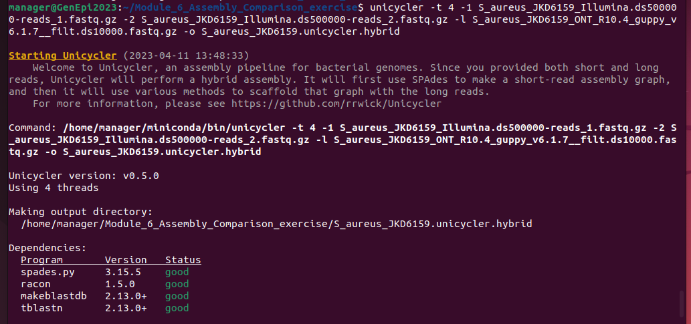

<br>


## Long Read only assembly (Dragonflye)
`Dragonflye` is an optimised pipeline written specifically for quickly assembling bacterial assemblies from Oxford Nanopore long read data. It uses the long read assembler `flye`, and has a number of speed optimisations to make it run efficiently. 

<br>

To get `dragonflye` running in the virtual machine, it has been installed using a tool called `mamba` (similar to `conda`). We need to 'activate' `mamba` to make `dragonflye` available:

```
conda activate dragonflye
```

<br>

Now we can run `dragonflye`. 

<br>

In the command below we:

- Allocate 4 CPUs to the assembler
    - `--cpus 4`
- Specify a maximum of 8 Gb memory to use
    - `--ram 8`
- Specify the ONT long reads to use
    - `--reads <fastq>`
- Specify a directory to output files to
    - `--outdir <dir>`


```
dragonflye --cpus 4 --ram 8 --reads S_aureus_JKD6159_ONT_R10.4_guppy_v6.1.7__filt.ds10000.fastq.gz --outdir S_aureus_JKD6159.dragonflye.long
```

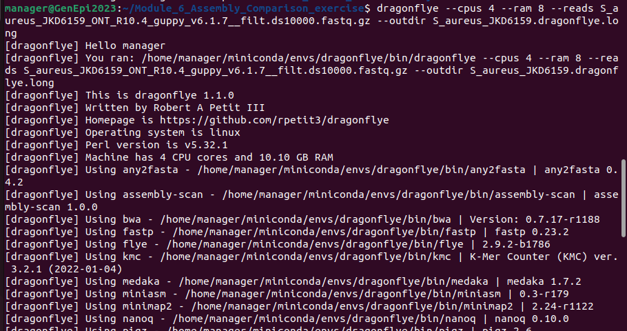


<br>

After using `dragonflye` in the conda environment, we need to deactivate the environment to be able to use other tools again 

```
conda deactivate
```

<br>


## Hybrid assembly (Dragonflye)
When `Dragonflye` is supplied with both long and short reads, it performs a long read assembly (as above), but then performs additional "polishing" steps using the short reads - these allow errors in the ONT reads to be corrected and is a very effective solution if you have both good long _and_ short reads available.

<br>

As above, to get `dragonflye` working, we need to activate the mambo environment:

```
conda activate dragonflye
```

<br>

In the command below we:

- Allocate 4 CPUs to the assembler
    - `--cpus 4`
- Specify a maximum of 8 Gb memory to use
    - `--ram 8`
- Specify the ONT long reads to use
    - `--reads <fastq>`
- Specify the Illumina forward and reverse reads to use 
    - `--R1 <fastq>` and `--R2 <fastq>` 
- Specify a directory to output files to
    - `--outdir <dir>`
- Specify a single round of short read polishing with `pilon`
    - `--pilon 1`
- Specify a single round of short read polishing with `polypolish`
    - `--polypolish 1`


```
dragonflye --cpus 4 --ram 8 --reads S_aureus_JKD6159_ONT_R10.4_guppy_v6.1.7__filt.ds10000.fastq.gz --R1 S_aureus_JKD6159_Illumina.ds500000-reads_1.fastq.gz --R2 S_aureus_JKD6159_Illumina.ds500000-reads_2.fastq.gz --outdir S_aureus_JKD6159.dragonflye.hybrid --pilon 1 --polypolish 1 
```

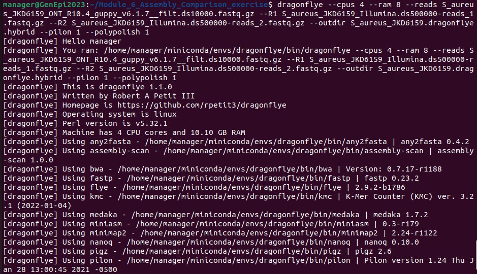

<br>

After using `dragonflye` in the conda environment, we need to deactivate the environment to be able to use other tools again 

```
conda deactivate
```

<br>

<br>


# Assessing Assembly Quality

To evaluate how well our assembly has performed, we can use a number of tools to extract metrics about: 
 - How long is my assembly?
 - How fragmented is it (how many contigs)?
 - What is the longest contig?
 - How many of the contigs are long and how many are short? 
    - We commonly use a metric called `N50`, which orders contigs by size (large to small) and reports length of the the contig where 50% of the total genome length is reached. 
 - How well does my assembly compare to the reference genome, and are there any missassembly errors? 
 - How 'complete' is my genome (how many of the 'core' genes we would expect to find in a bacterial assembly are actually present)

<br>

We will use a tool called `quast` to evaluate our assembly, including with respect to the reference genome. 


<br>

First, move into the directory where your assembly output directory is (depends on which method you used). 

e.g.  
```
cd S_aureus_JKD6159.dragonflye.hybrid

ls -lh
```

Your outputs will look slightly different, depending on which assembler and type of assembly you performed

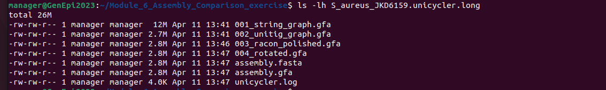

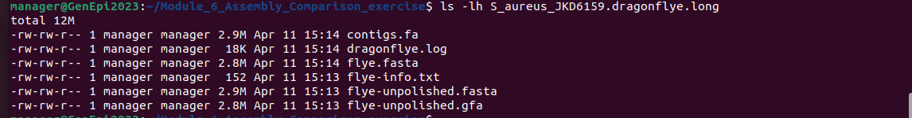

<br>
<br>


## Run Quast

To run quast on your assembly we:

- Assign 4 CPUs to the programme
    - `--threads 4`
- Specify a reference genome to compare against 
    - `-R <ref.fa>`
- Specify an output directory
    - `--output-dir <outdir>`
- Specify the assembly file (or files) to analyse
    - If the assembly was performed using `unicycler` it will be called `assembly.fasta`
    - If the assembly was performed using `dragonflye` it will be called `contigs.fa`

<br>

So for `unicycler`:
```
quast.py --threads 4 -R ../S_aureus_JKD6159.fasta --output-dir quast.output assembly.fasta
```
And for `dragonflye`:
```
quast.py --threads 4 -R ../S_aureus_JKD6159.fasta --output-dir quast.output contigs.fa
```

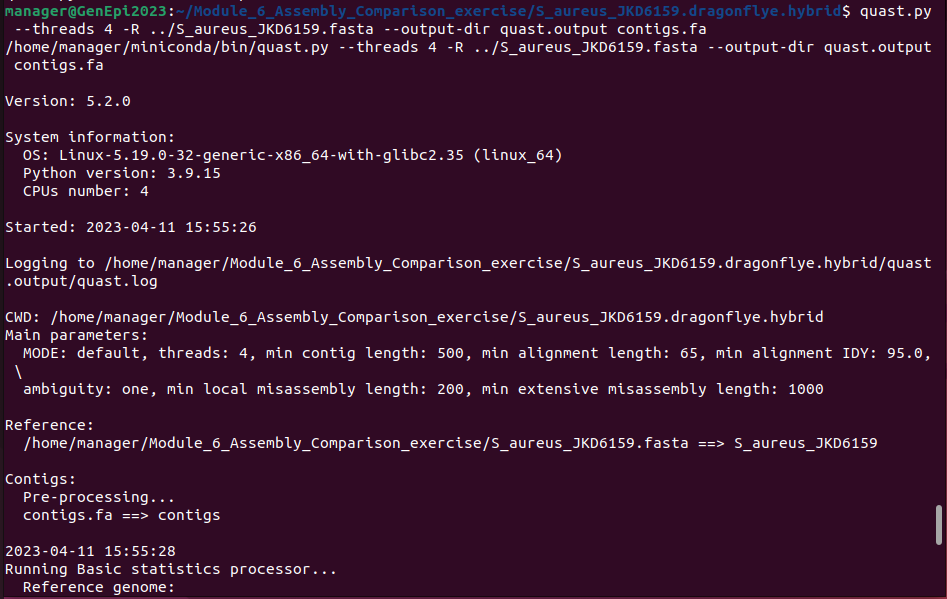

<br>

Quast has created a new directory `quast.output` containing lots of different files. 
``` 
ls -lh quast.output
```

<br>

Lets take a look at some of them:
```
cat quast.output/report.tsv
```

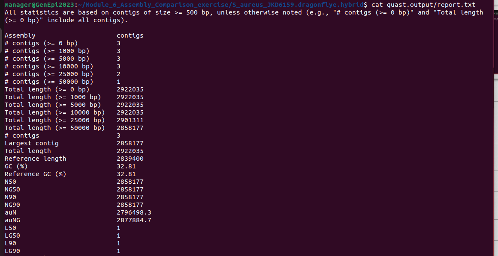


```
cat quast.output/contigs_reports/misassemblies_report.tsv
```
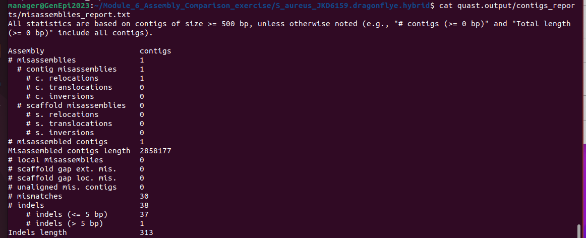


<br>
<br>

## Add details to class googlesheet
Add your assembly metrics to the google sheet at https://docs.google.com/spreadsheets/d/14HD7J1yyjgJAATjsHBSMbVS16jMsDYbaGWazVfjqRBc/edit?usp=sharing

<br>

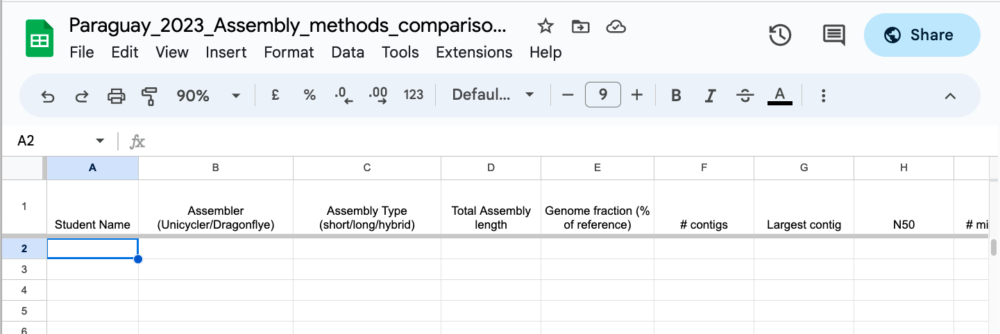


<br>

When all results are uploaded, we will put summary plots [here](https://github.com/WCSCourses/GenEpiLAC2023/blob/main/Manuals/Assembly_method_comparison/Assembly_Comparison_Results.md)

<br>

<br>

## Bonus - comparing SNPs between assemblies
### (Untested - might not work as planned)

We can also compare SNPs between our new assembly and the reference using a tool called `mummer`/`nucmer`.

To create a comparison between the reference genome and one of our new assemblies, first perform a rapid contig alignment using `nucmer`:

```
nucmer --prefix=dragonflye.long_vs_ref S_aureus_JKD6159.fasta S_aureus_JKD6159.dragonflye.long/contigs.fa
```
Then extract the snps using the `show-snps` command:
```
show-snps -Clr dragonflye.long_vs_ref.delta > dragonflye.long_vs_ref.snps
```
You can examine the SNPs identified using `less`:

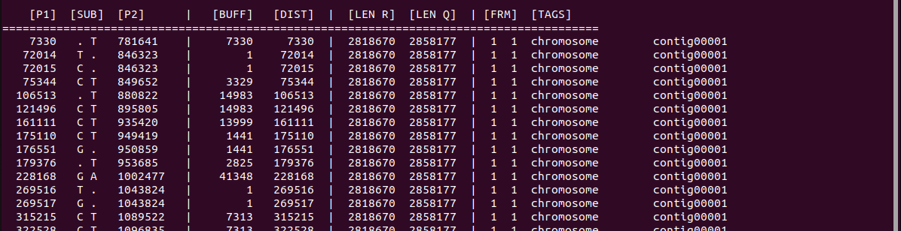

<br>

<br>


[<<< Go back to Manual Contents Page](https://github.com/WCSCourses/GenEpiLAC2023/blob/main/Manuals/README.md)

<br>
