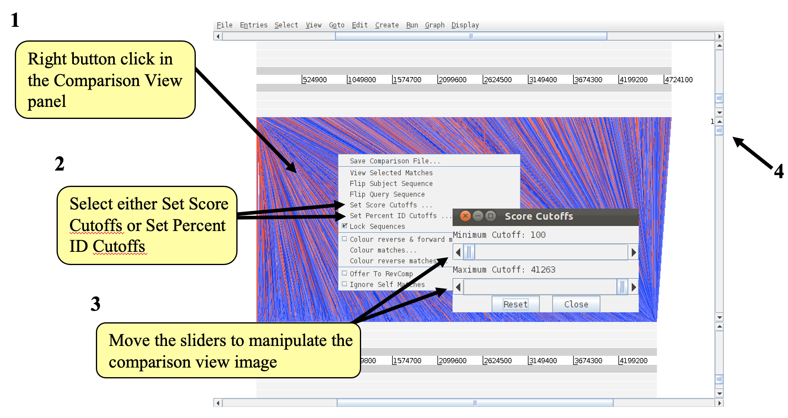
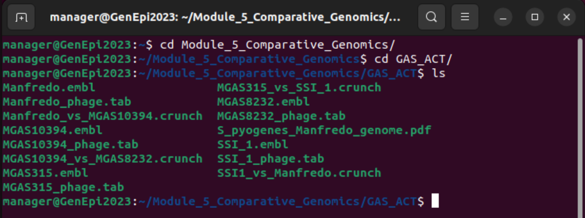

[<<< Go back to Manual Contents Page](https://github.com/WCSCourses/GenEpiLAC2023/blob/main/Manuals/README.md)

<br>

# Comparative genomics - Paraguay 2023 <!-- omit in toc -->

### Module Lead: Matt Holden <!-- omit in toc -->
<br>

# Table of contents <!-- omit in toc -->
- [Introduction](#introduction)
- [Aims](#aims)
- [Finding the data](#finding-the-data)
- [Starting up the `act` software](#starting-up-the-ACT-software)
- [The basics of `act`](#the-basics-of-act)
- [Exercise](#exercise) 
- [Things to try out in `act`](#things-to-try-out-in-act)
- [More things to try out in `act`](#more-things-to-try-out-in-act)
- [Bonus Exercise](#bonus-exercise)
<br> 


# [Introduction](#introduction)
<br>

The `artemis` Comparison Tool (`act`) was designed to extract the additional information that can only be gained by comparing the growing number of sequences from closely related organisms (Carver _et al_., 2005). `act` is based on `artemis`, and so you will already be familiar with many of its core functions, and is essentially composed of three layers or windows. 


The top and bottom layers are mini `artemis` windows (with their inherited functionality), showing the linear representations of the DNA sequences with their associated features. The middle window shows red and blue blocks, which span this middle layer and link conserved regions within the two sequences, in the forward and reverse orientation respectively. Consequently, if you were comparing two identical sequences in the same orientation you would see a solid red block extending over the length of the two sequences in this middle layer. If one of the sequences was reversed, and therefore present in the opposite orientation, there would be a blue ‘hour glass’ shape linking the two sequences. Unique regions in either of the sequences, such as insertions or deletions, would show up as breaks (white spaces) between the solid red or blue blocks. 


In order to use `act` to investigate your own sequences of interest you will have to generate your own pairwise comparison files. Data used to draw the red or blue blocks that link conserved regions is generated by running `blast` comparisons of the sequences, either pairwise BLASTN or TBLASTX. `act` is written so that it will read the output of several different comparison file formats. Two of the formats can be generated using `blast` software freely downloadable from the NCBI, which can be loaded and run a PC or Mac. A standalone version of `blast` has been installed on the disk image and can be run from the command line. In the Genome Assembly and Annotation module you will learn how to generate comparison files from `blast`. 

More details on `act` can be found here: http://sanger-pathogens.github.io/Artemis/ACT/

<br>


# [Aims](#aims)
<br>

* Become familiar with the basic functions of `act`
* Explore a comparison of the chromosomes of _Escherichia coli_ and _Salmonella enterica_ serotype Typhi


<br>

# [Finding the data](#finding-the-data)
Navigate to the `Module_5_Comparative_Genomics` directory

<br>

```
cd Module_5_Comparative_Genomics
```

We can confirm where we are: 

```
pwd
```

We can also examine the contents of this file:

```
ls -l
```

<br>


<br>


In the folder the files you will need for this exercise are:

- _E. coli_ K12 chromosomal sequence and annotation
  - _E. coli_ K12 sequence in fasta format (`EcK12.dna`)
  - _E. coli_ K12 annotation in embl format (`EcK12.tab`)
  - _E. coli_ K12 sequence and annotation in embl format (`EcK12.embl`)
- _Salmonella_ Typhi chromosomal sequence and annotation
  - _Salmonella_ Typhi sequence in fasta format (`S_typhi.dna`)
  - _Salmonella_ Typhi annotation in embl format (`S_typhi.tab`)
- `blastn` comparison of _E. coli_ K12 and _Salmonella_ Typhi chromosomes (`S_typhi.dna_vs_EcK12.dna.crunch`)


<br>


# [Starting up the `act` software](#starting-up-the-ACT-software)


<br>


Start `act` from the terminal window by typing `act &`


Click *File* then *Open*


Use the *File manager* to drag and drop files into the `act` file window:

* Drag `EcK12.dna` into the *Sequence file 1* box
* Drag `S_typhi.dna_vs_EcK12.dna.crunch` into the *Comparison file 1* box
* Drag `S_typhi.dna` into the *Sequence file 2* box


Alternatively you could select the files from the *Choose* option in the `act' file window

Once you have filled all the boxes, click the *Apply* button.


<br>


# [The basics of `act`](#the-basics-of-act)
<br>

You should now have a window like this so lets see what is there.


**1**. Drop-down menus. These are mostly the same as in `artemis`. The major difference you’ll find is that after clicking on a menu header you will then need to select a DNA sequence before going to the full drop-down menu.

**2**. This is the Sequence view panel for *Sequence file 1* (Subject Sequence) you selected earlier. It’s a slightly compressed version of the *artemis* main view panel. The panel retains the sliders for scrolling along the genome and for zooming in and out.

**3**. The Comparison View. This panel displays the regions of similarity between two sequences. Red blocks link similar regions of DNA with the intensity of red colour directly proportional to the level of similarity. Double clicking on a red block will centralise it. Blue blocks link regions that are inverted with respect to each other.

**4**. `artemis`-style Sequence View panel for *Sequence file 2* (Query Sequence).

**5**. Right button click in the Comparison View panel brings up this important `act`-specific menu which we will use later. 


<br>


# [Exercise](#exercise) 

<br>


In this first exercise we are going to explore the basic features of `act`. Using the `act` session you have just opened we firstly are going to zoom outwards until we can see the entire _S_. Typhi chromosome compared against the _E. coli_ K12 chromosome. As for the `artemis` exercises we should turn off the stop codons to clear the view and speed up the process of zooming out.


The only difference between `act` and `artemis` when applying changes to the sequence views is that in `act` you must click the right mouse button over the specific sequence that you wish to change, as shown above.


Now turn the stop codons off in the other sequence too.  Your `act` window should look something like the one below:


Once zoomed out your `act` window should look similar to the one shown above. If the genomes in view fall out of view to the right of the screen, use the horizontal sliders to scroll the image and bring the whole sequence into view, as shown below. 

You may have to play around with the level of zoom to get the whole genomes shown in the same screen as shown below.


Notice that when you scroll along with either slider both genomes move together. This is because they are ‘locked’ together. Right click over the middle comparison view panel. 

A small menu will appear, select Unlock sequences and then scroll one of the horizontal sliders. Notice that ‘LOCKED’ has disappeared from the comparison view panel and the genomes will now move independently


You can optimise your image by either removing ‘low scoring’ (or percentage ID) hits from view, as shown below **1-3** or by using the slider on the the comparison view panel (**4**). The slider allows you to filter the regions of similarity based on the length of sequence  over which the similarity occurs, sometimes described as the “footprint”. 





<br>


# [Things to try out in `act`](#things-to-try-out-in-act)
<br>

Load into the top sequence (S.typhi) a ‘.tab’ file  called `laterally.tab`. You will need to use the *File* menu and select the correct genome sequence (*S.typhi.dna*) before you can read in an entry. 


If you are zoomed out and looking at the whole of both genomes you should see the above. 

The small white boxes are the regions of atypical DNA covering regions that we looked at in the first `artemis` exercise. 

It is apparent that there is a backbone sequence shared with _E. coli_ K12, plus chunks of _S_. Typhi specific DNA, which appear to be insertions relative to _E. coli_ K12.   


<br>

# [More things to try out in `act`](#more-things-to-try-out-in-act)

<br>

- Double click red boxes to centralise them.

- Zoom right in to view the base pairs and amino acids of each sequence.

- Load annotation files into the sequence view panels.

- Use some of the other `artemis` features eg. graphs etc.

- Find an inversion in one genome relative to the other then flip one of the sequences.


<br>

# [Bonus Exercise](#bonus-exercise)

<br> 

In the the `Module_5_Comparative_Genomics` directory there is an additional directory that contains a bonus exercise. This exercise compares of the chromosomal structures of the Gram-positive pathogen, _Streptococcus pyogenes_ (also known as Group A _Streptococcus_, which is often abbreviated to GAS).

Move into the GAS_ACT directory by typing:

```
cd GAS_ACT
```

If you type `ls` you will be able to see the contents of the directory:





In the folder you will see a pdf file of a publication describing the genome of an _emm_ type 5 isolate of GAS, Manfredo (`Holden _et al_., 2007 https://journals.asm.org/doi/10.1128/JB.01227-06). In the publication the chromosome of Manfredo is compared to the chromosomes of 4 other GAS isolates (MGAS315, SSI-1, MGAS10394 and MGAS8232) and displayed in figure generated from `act` (Figure 2).


Also in the folder are files that can be loaded up in `act` to recreate the figure and explore further. 


The files are: 

- Chromosomal sequence and annotation files in embl format:
  - Manfredo.embl
  - MGAS315.embl
  - SSI-1.embl
  - MGAS10394.embl
  - MGAS8232.embl
- Prophage regions of the chromosomes in embl format:
  - Manfredo_phage.tab
  - MGAS315_phage.tab
  - SSI-1_phage.tab
  - MGAS10394_phage.tab
  - MGAS8232_phage.tab
- Pairwise `blastn` comparison files:
  - MGAS315_vs_SSI-1.crunch
  - SSI-1_vs_Manfredo.crunch
  - Manfredo_vs_MGAS10394.crunch
  - MGAS10394_vs_MGAS8232.crunch


<br>

If you have the `act` open from the previous exercise close it.


Start `act` as before from the terminal window by typing ‘act &’


Click *File* then *Open*


You will then need to click the *more files* buttons 3 times to expand the number of sequence and comparison boxes in the `act` file window.


Use the *File manager* to drag and drop files into the `act' file window:

* Drag `MGAS315.embl` into the *Sequence file 1* box
* Drag `MGAS315_vs_SSI-1.crunch` into the *Comparison file 1* box
* Drag `SSI-1` into the *Sequence file 2* box
* Drag `SSI-1_vs_Manfredo.crunch` into the *Comparison file 2* box
* Drag `Manfredo.embl` into the *Sequence file 3* box
* Drag `Manfredo_vs_MGAS10394.crunch` into the *Comparison file 3* box
* Drag `MGAS10394.embl` into the *Sequence file 4* box
* Drag `MGAS10394_vs_MGAS8232.crunch` into the *Comparison file 4* box
* Drag `MGAS8232.embl` into the *Sequence file 5* box


Once you have filled all the boxes, click the *Apply* button.


Once `act` has opened you can start customising the view and files loaded and explore the sequence and comparisons.

Things to do:

* Load up the prophage annotation files into the respective entries (*Remember, you will need to use the *File* menu and select the correct genome sequence before you can read in an entry*) 

* Filter the blast matches in the comparison window to reduce the number and amount of matches displayed (*Remember, you can filter on blast match size or score or percent ID)

* Zoom in and out to see the conservation of chromosome structure and regions of difference

* Compare the prophage regions across the GAS isolates (To see these clearly you may need to deselect the embl entry under each individual entry.

* Enjoy


<br>


[<<< Go back to Manual Contents Page](https://github.com/WCSCourses/GenEpiLAC2023/blob/main/Manuals/README.md)

<br>
