[<<< Go back to Manual Contents Page](https://github.com/WCSCourses/GenEpiLAC2023/blob/main/Manuals/README.md)

<br>

# Mapping and Phylogenetics - Paraguay 2023 <!-- omit in toc -->

### Module Lead: Mat Beale <!-- omit in toc -->
<br>

    
# Table of contents <!-- omit in toc -->
- [Module Overview and Aims](#module-overview-and-aims)
- [Introduction](#introduction)
  - [Mapping to reference genome](#mapping-to-reference-genome)
  - [Sequencing data formats](#sequencing-data-formats)
  - [Fastq format](#fastq-format)
  - [Map to reference - SAM format](#map-to-reference---sam-format)
  - [Variant Calling](#variant-calling)
  - [Consensus calling](#consensus-calling)
- [Practical Exercise - Mapping \& Phylogeny](#practical-exercise---mapping--phylogeny)
  - [Finding the data](#finding-the-data)
  - [Perform mapping of reads to reference genome using snippy](#perform-mapping-of-reads-to-reference-genome-using-snippy)
    - [Examine `snippy` logs](#examine-snippy-logs)
    - [Examine `snippy` outputs](#examine-snippy-outputs)
  - [Map a second genome to reference](#map-a-second-genome-to-reference)
  - [Contextualise new genomes with a collection](#contextualise-new-genomes-with-a-collection)
  - [Phylogenetics](#phylogenetics)
    - [Make a SNP-only alignment using `snp-sites`](#make-a-snp-only-alignment-using-snp-sites)
    - [Calculate a phylogenetic tree from the SNPs using `IQ-TREE2`](#calculate-a-phylogenetic-tree-from-the-snps-using-iq-tree2)
    - [Accounting for recombination with `gubbins`](#accounting-for-recombination-with-gubbins)
    - [Root a phylogeny](#root-a-phylogeny)
    - [Clustering genomes using `fastBAPS`](#clustering-genomes-using-fastbaps)
    
<br>

# Module Overview and Aims

<br>

When we sequence a genome, we aim to capture information about: 
*  Single Nucleotide Polymorphisms (SNPs)
*  Insertions and Deletions (INDELs) 
*  Copy Number Variations (CNVs)
*  Structural rearrangements
*  Gene gain and loss (i.e. the pangenome)


There are two main approaches used for reconstructing bacterial genomes for population analyses. 

* _De novo_ assembly
* Map to Reference genome

Each has benefits and limitations. This module will focus on Reference mapping. 

For reference mapping, whether we are dealing with different bacterial isolates, with viral populations in a patient, or even with genomes of different human individuals, the principles are essentially the same. Instead of assembling the newly generated sequence reads _de novo_ to produce a new genome sequence, it is easier and much faster to align or map the new sequence data to the reference genome (please note that we will use the terms “aligning” and “mapping” interchangeably). We can then readily identify SNPs and INDELs that distinguish closely related populations or individual organisms and may thus learn about genetic differences that may cause drug resistance or increased virulence in pathogens, or changed susceptibility to disease in humans. One important prerequisite for the mapping of sequence data to work is that the reference and the re-sequenced subject have the same genome architecture.

In this exercise, we will use sequence data from _Vibrio cholerae_ genomes to learn about mapping and phylogenetics. Importantly, although the genome data is real, the collection has been assembled for the purpose of this practical exercise, and has also been edited to make it run more efficiently in the Virtual Machine training environment. 


<br>

# [Introduction](#introduction)

## [Mapping to reference genome](#mapping-to-reference-genome)

<br>


<br>

## [Sequencing data formats](#Sequencing-data-formats)
Raw data directly from the sequencer may be in sequencer-specific formats, but will always be converted to `fastq` format for downstream analysis. `fastq` is a plain text format that is standard within bioinformatics.

<br>

## Fastq format


<br>

In a fastq file, each sequencing read is represented by 4 different rows

- Read ID
   - always begins with ‘@’
   - Often includes information about sequencer and location on flow cell
- Sequence info
   - The DNA sequence (A, T, G, C, N) at each position in read
- Comment Line
   - Begins ‘+’, allows for additional information to be included – rarely used
- Quality scores
   - Score for each base position in read – in ASCII code.

<br>

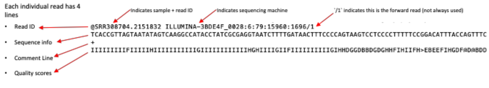

<br>

## Map to reference - SAM format

Each FASTQ contains thousands to millions of sequencing reads

Matching each read to the correct place in the genome (allowing for changes and errors) is computationally challenging

We use a ‘read aligner’ to map the position each read belongs to on a reference genome

 * Short Reads - `BWA`, `Bowtie2`
 * Long Reads - `minimap2`

Mapping produces a `SAM` file (or the compressed binary version `BAM` file)

We often use a tool called `samtools` to manage and view these large and complex files

<br>


<br>

## Variant Calling
When reads are aligned to a reference genome, point mutations (SNPs) between the sequencing reads and the reference can be identified. In the plot below:
*  Reads are in<span style="color:blue"> *blue* </span>/<span style="color:green"> *green*</span>.
* Changes from the reference are highlighted for each read in <span style="color:red"> *red*</span>.

<br>


 - Some variants can be very easy to determine
However, sequencing error can lead to changes that are technical artefacts
 - Some variants are therefore more difficult to determine (e.g. a low coverage region with very few reads)
 - What if some reads correspond to a SNP and others do not?

 - Variant callers (e.g. `bcftools`, `GATK`, `FreeBayes`) apply statistical models to determine true variants, accounting for:
 - Reads counts/proportions supporting each allele
 - Quality scores for base, reads, mapping, position in the read a variant occurs
 - Variant callers output their analysis in a ‘variant call format’ – `VCF` file

<br>

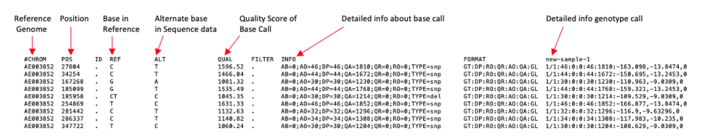

<br>

## Consensus calling

- Variant calls will be filtered and assessed (generally in an automated way).
- Once we have a filtered variant set, variants can be applied to the reference genome.
- This generates a consensus ‘pseudosequence’ in FASTA format.

<br>


<br>

- Note, that one important step that can be overlooked is false negative variant calls
  - VCF format only highlights changes from the reference (i.e. positive calls)
  - If a base position has low coverage and no SNP is called, how do you know if there is a SNP or not?
  - Some methods will simply assume that the site is ‘reference’, without evidence to the contrary
  - This can give misleading results for some analyses (e.g. phylogenetics)
  - Important to ensure all sites without support are tested, and marked as ‘N’. 

<br>

We can use integrated pipelines to automate parts of these processes

<br>

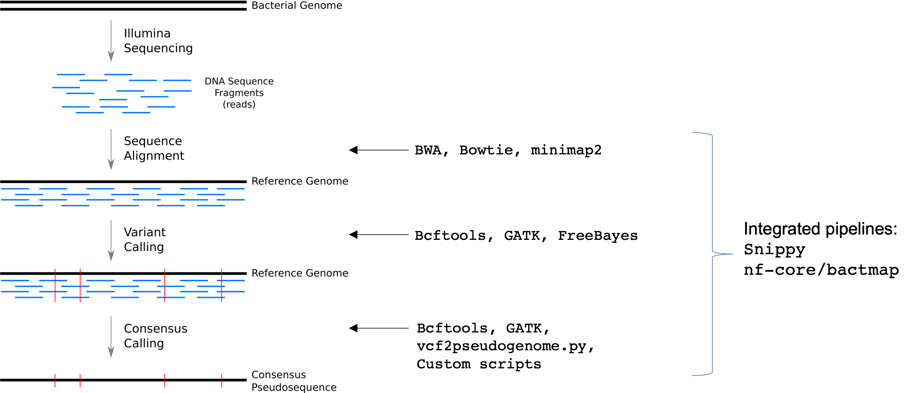

<br>
<br>

# Practical Exercise - Mapping & Phylogeny

## Finding the data 
Navigate to the `Module_5_Mapping_and_Phylogeny` directory

```
cd Module_5_Mapping_and_Phylogeny
```

We can confirm where we are 
```
pwd
```

We can also examine the contents of this file
```
ls -l
```


<br>

The folder contains:

- two pairs of sequencing reads :
  - `new-sample-1_1.fastq.gz`, `new-sample-1_2.fastq.gz`
  - `new-sample-2_1.fastq.gz`, `new-sample-2_2.fastq.gz`
- a folder containing indexed reference genomes
- an archive file containing previous `snippy` runs (`snippy.runs.1.tar.gz`)

<br>

## Perform mapping of reads to reference genome using snippy
`Snippy` is an integrated pipeline that maps reads to a reference genome and produces a range of outputs. For the purposes of this tutorial, we will use `snippy` to organise analyse our genomes.

You can view the options for snippy using the following code:
```
snippy -h
```


<br>

Now run `snippy` on the pair of fastqs (for this exercise we’ll call this ‘new-sample-1’)
```
snippy --outdir new-sample-1 --R1 new-sample-1_1.fastq.gz --R2 new-sample-1_2.fastq.gz --ref references/Vibrio_cholerae_O1_biovar_eltor_str_N16961_v2.fa --cpus 4 --ram 4 --force --quiet
```

Wait for `snippy` to finish


Examine results of `snippy`

```
ls -lh new-sample-1/
```


You can examine the log file to see exactly what `snippy` has done

```
less new-sample-1/snps.log
```

<br>

### Examine `snippy` logs

We’ll use `grep` to retrieve the relevant lines for each command from the log file.

First, here is the command we used to set `snippy` running
```
grep "outdir" new-sample-1/snps.log
```
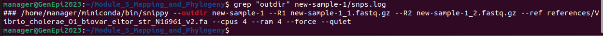

After ensuring the reference genome is indexed, `snippy` maps the reads to the reference genome using `bwa mem`
```
grep "bwa mem" new-sample-1/snps.log
```


Within that command, `snippy` also marks duplicate sequencing reads using `samtools markdup` (we extract only the first part of that command here, but you can look for it with `less`)
```
grep "COMMAND: samtools" new-sample-1/snps.log
```


`Snippy` then uses `FreeBayes` to call variants against the reference genome, producing a variant call file (.vcf)
```
grep "freebayes" new-sample-1/snps.log
```


`Snippy` then applies some filters to assess the quality of those variants. It then applies the high quality variants to the reference genome to create a ‘pseudosequence consensus’ representation of our new genome
```
grep "bcftools consensus" new-sample-1/snps.log
```


`Snippy` creates two versions of the pseudosequence consensus:
- `snps.consensus.fa` contains all high quality variants
- `snps.consensus.subs.fa` contains only high quality SNPs (no INDELS)

<br>


### Examine `snippy` outputs

The `bam` file contains all the mapping positions on the genome for each individual read, along with metrics around mapping quality. This is a binary (machine readable) file, but we can view it using `samtools view`
```
samtools view  new-sample-1/snps.bam | head -2
```


The `VCF` file contains all the variants that have been called in our new genome compared to the reference genome
```
head -35 new-sample-1/snps.vcf 
```


The first ~28 lines here are ‘headers’ and contain information about what has been done to call the variants, and helps you to interpret what different columns mean.

The last ~7 lines are individual variants, one per line. Variants columns are labelled 
```
#CHROM POS ID  REF ALT QUAL    FILTER  INFO    FORMAT  new-sample
```

We can view a slightly easier summary of these variants in the snps.tab file
```
head -5 new-sample-1/snps.tab
```
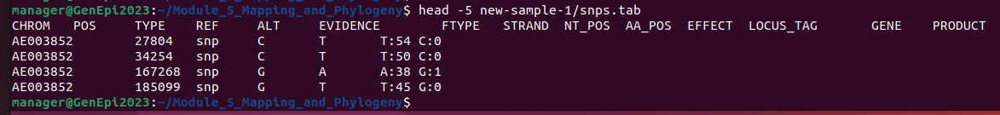

In this file, we have not provided gene information, so only the first 6 columns are relevant

`Snippy` has also created a `fasta` file with our pseudosequence genome
```
head new-sample-1/snps.consensus.fa
```


<br>

## Map a second genome to reference 
We now need to map the second genome (`new-sample-2`) to our reference

Use the code examples provided above to run `snippy` on the second set of `fastq` files

Examine the results of snippy for `new-sample-2` using `grep`, `ls` and `less`


<br>

## Contextualise new genomes with a collection
Now lets look at this new genome in context with a collection. 

We can add this genome to a collection of genomes mapped using `snippy-core`. First, let’s extract the old `snippy` runs from our archive file
```
tar -zxf old.snippy.runs.2023.tar.gz
```
We can see that we now have a new directory `old.snippy.runs`
```
ls -lh
```
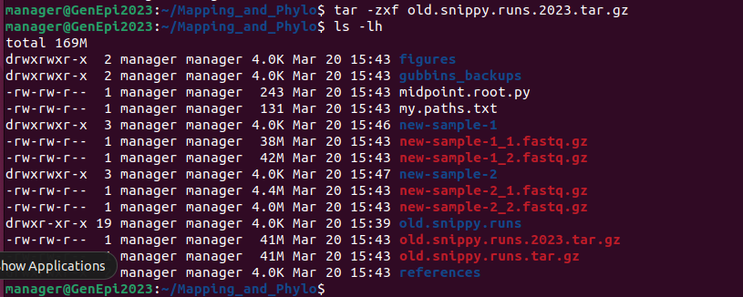

```
ls -lh old.snippy.runs
```
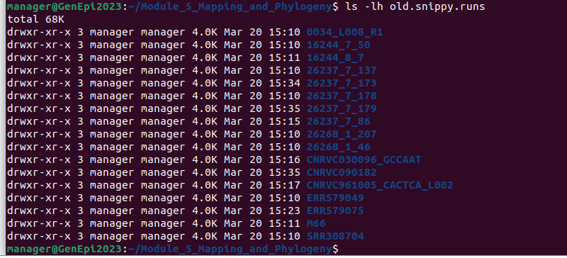

<br>

Now lets use `snippy-core` to summarise all these genomes along with the new ones and create a multiple sequence alignment

```
snippy-core --ref new-sample-1/ref.fa old.snippy.runs/* new-sample-1 new-sample-2
```
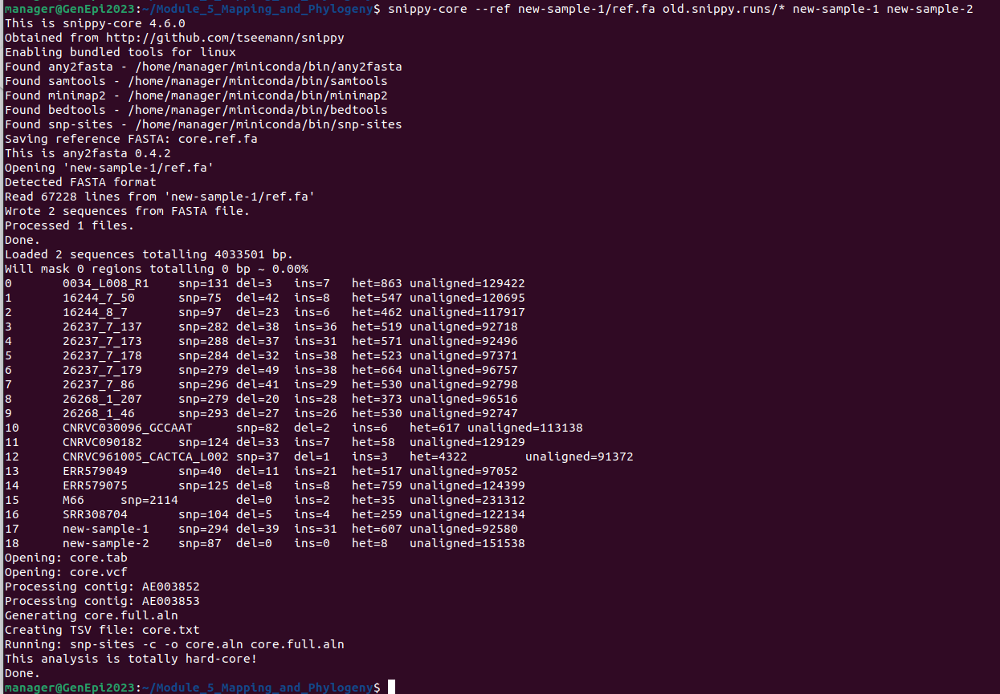

`Snippy` has now created a number of files, including a ‘core SNP alignment’
```
ls -l core.*
```


We have various files that summarise our variants, e.g.
```
head core.tab 
```
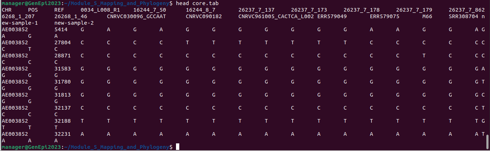

And our multiple sequence alignment containing all genomes:
```
head core.full.aln
```


This file masks sequences with low confidence in different ways, but for some applications we want everything masked in the same way. Let’s change that so anything uncertain is marked as ’N’ using the `snippy-clean_full_aln` script that comes with `snippy`.
```
snippy-clean_full_aln core.full.aln > clean.full.aln
```


<br>

## Phylogenetics

Now that we have a clean multiple sequence alignment, we are now going to use `IQ-TREE` to build a maximum likelihood phylogeny.

### Make a SNP-only alignment using `snp-sites`

Calculating a phylogeny on whole genome sequences can be very time consuming. We can speed this up by only using the variable sites (SNPs). However, we need to be aware that only including variable sites can affect the evolutionary rate estimates made by phylogenetics software - therefore, we need to account for the sites we remove in our analysis.

We will use `snp-sites` to do this. You can view the options for `snp-sites`
```
snp-sites
```


First, remove all the invariant sites and create a SNP-only multiple sequence alignment.
```
snp-sites -o clean.full.SNPs.aln clean.full.aln
```
We can see how many invariant sites were removed (and what proportion of A, T, G, C they were) using
```
snp-sites -C clean.full.aln
```


<br>

### Calculate a phylogenetic tree from the SNPs using `IQ-TREE2`
We can look at the options for `IQ-TREE` below
```
iqtree -h
```


<br>

In the command below, we:
 - specify the multiple sequence alignment using `-s clean.full.SNPs.aln`
 - ask `IQ-TREE` to take account of missing invariant sites using `-fconst $(snp-sites -C clean.full.aln)`
 - specify an evolutionary model we want `IQ-TREE` to use `-m GTR+F+I`
 - tell `IQ-TREE` to use a maximum of 2 CPUs (threads) and 2GB memory `-T 2 -mem 2G`
 - perform 1000 ultrafast bootstraps `-B 1000`
 - use sample `M66` as an outgroup `-o M66`

```
iqtree -s clean.full.SNPs.aln -fconst $( snp-sites -C clean.full.aln ) -m GTR+F+I -T 2 -mem 2G -B 1000 -o M66
```


<br>

Look at folder
```
ls -lh clean.full.*
```


<br>

Our maximum likelihood tree is labelled `clean.full.SNPs.aln.treefile`. The `treefile` suffix is not always correctly identified by many tools, so we'll relabel this as something else:

```
cp clean.full.SNPs.aln.treefile clean.full.SNPs.aln.tre
```


We can look at the raw text 
```
cat clean.full.SNPs.aln.tre
```


But this is not very helpful - it's just raw text in 'newick' format. 

Instead, we can visualise this using `figtree`
```
figtree clean.full.SNPs.aln.tre &
```


Ignore the java error messages. The popup box is asking you how to describe the 'bootstrap values'. You can click 'OK' here.

You should now have a visualisation of the tree we just generated


<br>

We can also visualise our tree using a webtool called `Microreact`

 - Open Firefox and navigate to https://microreact.org/
 - Click 'upload'


 <br>

 - Select the file upload, or drag the tree file `clean.full.SNPs.aln.tre` onto the upload screen


<br>

Microreact may not recognise the file, so let's tell micoreact this this is a tree in `newick` format. Note that we can also use this screen to add metadata in `csv` format.


<br>

Click `continue` to view the tree


<br>
<br>

### Accounting for recombination with `gubbins`
We can use `gubbins` to infer recombining sites by looking for increased SNP density that occurs in specific ancestral nodes

```
run_gubbins.py -h
```


<br>

The following command runs `gubbins` on standard settings, with 4 CPUs.

Note: the `-c` option tells the program to use 4 CPUs. Note: the `-p` option tells the program to name all files with the prefix `gubbins`
This command can take a few minutes to run.

```
run_gubbins.py -c 4 -p gubbins clean.full.aln
```


<br>

NB. If gubbins takes more than 10 mins to complete, we have already run it for you - the files are available at `~/Module_5_Mapping_and_Phylogeny/gubbins_backups/`. 

```
ls -lh gubbins_backups/
cp gubbins_backups/* ./
```

<br>

Lets look at what gubbins has done
```
ls -l gubbins.*
```

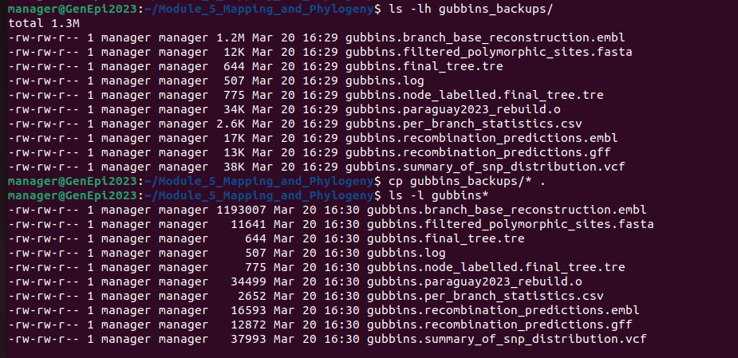


<br>

You can explore these files
For example `gubbins.recombination_predictions.gff` is a `gff` file that contains a record of each recombination block identified, how many SNPs it contains, and what samples are affected.
```
head gubbins.recombination_predictions.gff
```


<br>

`gubbins.filtered_polymorphic_sites.fasta` is a `fasta` file containing only SNPs, where recombining sites have been ‘masked to N’.
```
head gubbins.filtered_polymorphic_sites.fasta
```


<br>

`gubbins.final_tree.tre` is a phylogeny in which recombination has already been accounted for. 

You can visualise this in `figtree` or `microreact` as above.  
<br>

### Root a phylogeny
The trees outputted by iqtree and gubbins are unrooted, but we may want to apply some evolutionary direction to them. One approach that is commonly used for bacterial datasets is midpoint rooting. Midpoint rooting involves locating the midpoint of the longest path between any two tips and putting the root in that location. Note that this does not necessarily infer the _true_ root, and this should be used with caution. 

To midpoint root our tree, we will use a simple script written in `python` that uses the `ete` package. You can examine the code:

```
less midpoint.root.py
```


<br>

We can use this script to midpoint root our tree 
```
python midpoint.root.py gubbins.final_tree.tre > gubbins.final_tree.midpoint.tre
```

You can visualise this in `figtree` or `microreact` as above. How does it compare to the unrooted version? 

<br>

We can also visualise the tree together with the recombination blocks inferred by `gubbins` using a webtool called `phandango` 

Using your browser, navigate to (https://jameshadfield.github.io/phandango/#/)


<br>

On your VM desktop, go to the file manager, and navigate to `/home/manager/Mapping_and_+_Phylogeny`

Drag and drop the tree file `gubbins.final_tree.midpoint.tre` into the phandango browser window

Drag and drop the recombination gff file `gubbins.recombination_predictions.gff` into the phandango browser window

Phandango should automatically display blocks of recombination in <span style="color:red"> *red* </span> (ancestral) and <span style="color:blue"> *blue* </span>(specific to a sample)


<br>
<br>

### Clustering genomes using `fastBAPS`
We can cluster genomes for epidemiology in a variety of ways, depending on the goal and genetic distances involved. Here will use `fastBAPS`, which is an optimised  implementation of the original `hierBAPS` algorithm for hierarchical partitioning and Bayesian clustering of genomes. `fastBAPS` can be run in `R` as well as from the command line.

In the command below, we:
* specify a set of SNPs/alleles for use by the model 
  * `-i gubbins.filtered_polymorphic_sites.fasta`
* specify the name of the output file 
  * `-o fastbaps.clusters.csv`
* specify that we want hierarchical clustering at two different levels (i.e. BAPS will attempt to subdivide "level 1 clusters" to form "level 2 clusters") 
  * `--levels 2`
```
run_fastbaps -i gubbins.filtered_polymorphic_sites.fasta -o fastbaps.clusters --levels 2
```

We can view the output using `head` or `cat`

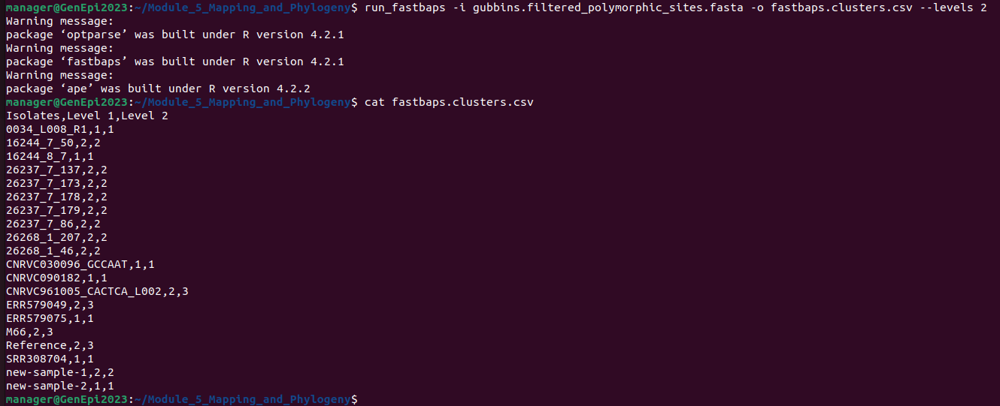

<br>

Now that we have clusters, let’s see how they look against the phylogenetic tree we made earlier. 

<br>

First, we'll need to make the `csv` file with our clusters compatible with `microreact`. We need to change the header of the first column from `Isolates` to `ID`. We'll use some simple code on the command line to do this:

```
sed s/Isolates/ID/ fastbaps.clusters > fastbaps.clusters.fixid.csv

head fastbaps.clusters.fixid.csv
```


<br>

Go to the `microreact` webpage, and try uploading the new gubbins filtered tree and the fastbaps clusters


<br>


You can see that the first column has been correctly identified as the 'ID' - this will be linked to the taxa in the tree


Click `Continue`

You should now see a tree coloured by your fastbaps groups. You can use the toggles to change the colouring and to add metadata blocks.


<br>

<br>

END


[<<< Go back to Manual Contents Page](https://github.com/WCSCourses/GenEpiLAC2023/blob/main/Manuals/README.md)

<br>

