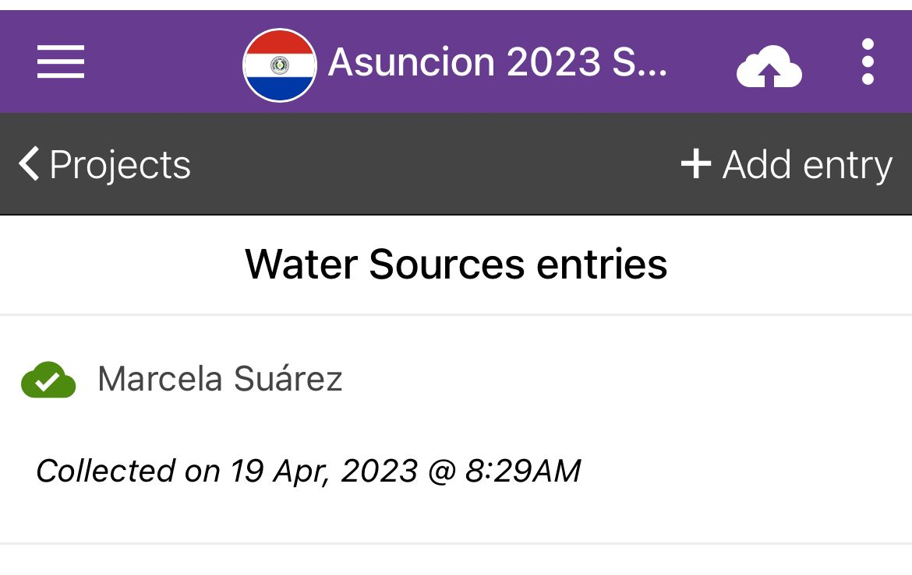
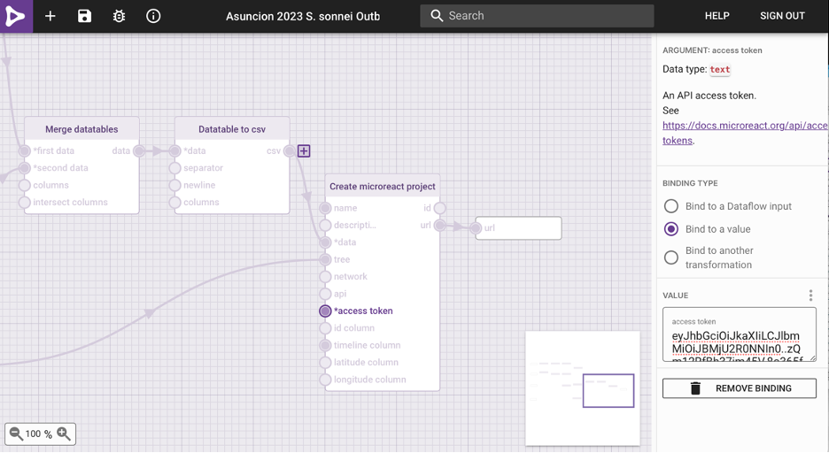
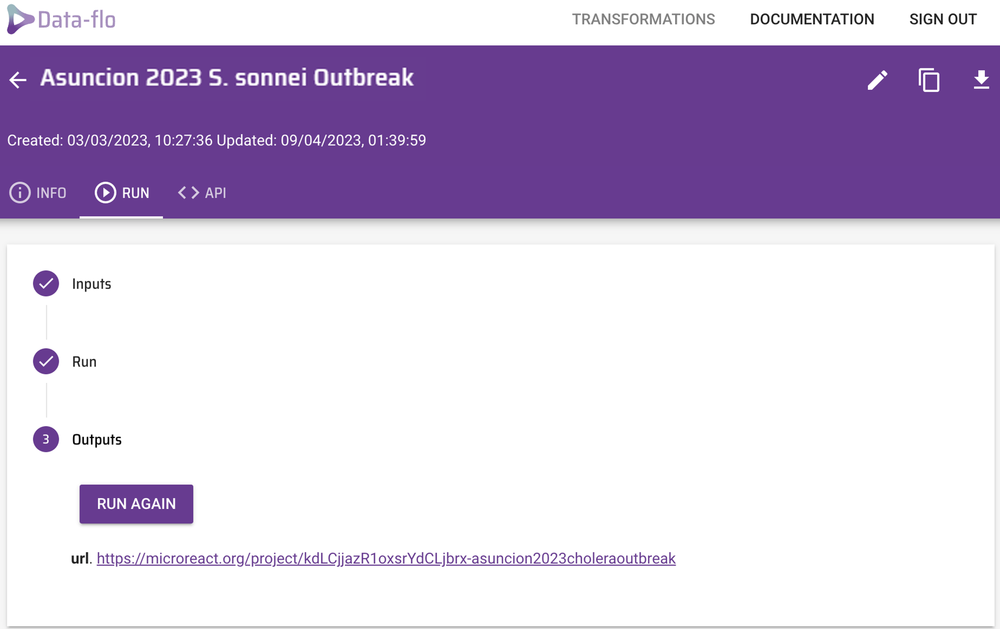

# Web Tools for Genomic Epidemiology - Paraguay 2023 <!-- omit in toc -->

### Module Lead: Silvia Argimon & Julio Diaz Caballero <!-- omit in toc -->
 

# Table of contents <!-- omit in toc -->
- [Background](#background)
- [Introduction](#introduction)
- [Learning outcomes](#learning-outcomes)
  - [Collect field data with Epicollect](#collect-field-data-with-epicollect)
  - [Merge data with Data-flo](#merge-data-with-data-flo)
  - [Microreact](#microreact)
- [Resources](#resources)
  - [Install and test Epicollect5 on your mobile phone](#install-and-test-epicollect5-on-your-mobile-phone)
  - [Sign-in to data-flo](#sign-in-to-data-flo)
  - [Sign-in to Microreact](#sign-in-to-microreact)
  - [Web colours](#web-colours)
- [Bonus activities](#bonus-activities)

# Background
Genomic epidemiology aims to understand the emergence and dissemination of high-risk clones within pathogen populations with the ultimate goal of implementing evidence-based interventions to protect public health. High-risk clones are subpopulations/strains/variants of a pathogen that carry risk elements, such as antibiotic resistance or virulence determinants, and thus pose a potential risk to public health.

The increased genetic resolution afforded by genomic data is useful from global to local geographic scales, and it has proven particularly useful for the investigation of pathogens that exhibit little genetic variation (cite), and for outbreak investigations (cite). During outbreak investigations (and other genomic epidemiology studies), epidemiological data from patients is collected by healthcare professionals. Antimicrobial susceptibility data, species identification, and any further phenotypic or molecular characterization of the isolates is often generated by the laboratories linked to healthcare facilities and/or by the reference laboratory. Ideally, these different sources of data are stored in a centralised surveillance system and database, such as WHONET. However, these systems rarely incorporate genomic data produced by bioinformaticians. Genomic data may include sequence/assembly quality, genotyping/genoserotyping information, presence/absence of known risk elements, and clustering of the isolates based on genetic similarity –usually in the form of a phylogenetic tree or a minimum spanning-tree.

The job of a genomic epidemiologist often starts by combining data from diverse sources that might not be complete or standardised to facilitate the identification of relevant patterns for meaningful interpretation. Once integrated, the epi, lab, and genomic data can be interrogated over the structure of the tree to identify clusters of interest that will place the isolates in or out of the outbreak.

The **[Centre for Genomic Pathogen Surveillance](https://www.pathogensurveillance.net/our-software/)** develops free web applications for data collection, integration, visualisation, and analysis of genomic epidemiology data. **[Epicollect5](https://five.epicollect.net/)** is a mobile & web application for free and easy data collection. It provides both the web and mobile applications for the generation of forms (questionnaires) and freely hosted project websites for data collection. Projects are created by using the web application at five.epicollect.net, and then downloaded to the device to perform the data collection. Data are collected in the field using multiple devices and all data can be viewed on a central server (via map, tables, and charts). **[Data-flo](https://data-flo.io/)** is a system for customised integration and manipulation of diverse data via a simple drag and drop interface. Data-flo provides a visual method to design a reusable pipeline to integrate, clean, and manipulate data in a multitude of ways, eliminating the need for continuous manual intervention (e.g., coding, formatting, spreadsheet formulas, manual copy-pasting). **[Microreact](https://microreact.org/)** allows you to upload, visualise and explore any combination of clustering (trees), geographic (map) and temporal (timeline) data. Other metadata variables are displayed in a table. You can specify colours and/or shapes to display on the map, tree and/or timeline. A permanent URL is produced for you to share your Microreact.

# Introduction
Aim:  To use web and mobile tools for the collection of epi data in the field, its integration with lab and bioinformatics data, and to finally visualise it together to detect a putative outbreak.

*Note: This exercise is a work of fiction. Any resemblance to a real cholera outbreak is purely coincidental.*

During January and February 2023, fifty-eight patients reported to nine hospitals in Asunción with acute watery diarrhoea and vomiting. Vibrio cholerae was isolated from the stool samples of thirty-four patients (all belong to serotype Inaba), and one colony from each confirmed case was sequenced on Illumina MiSeq. An epidemiological investigation revealed that more than half of the culture-confirmed cases regularly visited the Ñu Guazú Park, where water fountains and a lake are accessible, and which is crossed by the Arroyo Itay. This suggested that the outbreak could be caused by contaminated water in the park. The epidemiological and demographic data is summarised on the file epi_data.csv.

A team of disease detectives will be deployed around Ñu Guazú Park today to investigate the potential source of the outbreak using Epicollect5, data-flo, and Microreact, free mobile and web applications developed by the Centre for Genomic Pathogen Surveillance for easy data collection, integration and visualisation.

# Learning Outcomes
At the end of this session the participants will be able to:

1. Collect data in the field with Epicollect5.
2. Merge epidemiological, laboratory and genomic data with data-flo
3. Create a Microreact project to visualise epidemiological, laboratory and genomic data

## 1. Collect field data with Epicollect
`https://five.epicollect.net/`

The disease detectives will work in pairs, and will be provided with a **collection tube** with a **barcode** sample identifier to collect a sample of water, and will use their **mobile phone** to collect associated metadata in the field.

Make sure your phone is connected to WiFi.
Open the **Epicollect5** app on your mobile phone.

 

Add the project **Asuncion 2023 Cholera Outbreak** by typing into the search box --you will need to be connected to WiFi.

 

Using the map of the Ñu Guasú park provided, walk to the location of your collection point (water source). Locations are indicated by the red dots labelled a-j.

**PASTE IMAGE OF MAP WITH LOCATIONS (to be finished)**

 

Open the **Asuncion 2023 Cholera Outbreak** project and add an entry. Follow the form to collect a water sample and associated metadata.

 

Your team will collect only one water sample, but both of you can collect the associated data on Epicollect5. However, make sure that only one of you uploads the data later on to avoid duplications.

Return to the Epidemic Intelligence Center (i.e. the classroom).

One of the pair members only. **Upload your entry (and image)** to the Epicollect5 server --make sure you are connected to the WiFi.

 

Submit your water sample to the instructor, which will be sent to the reference lab for culture confirmation.

Once all entries are uploaded by the disease detectives we will take a look at the data together on **[https://five.epicollect.net/project/asuncion-2023-cholera-outbreak](https://five.epicollect.net/project/asuncion-2023-cholera-outbreak)**

Answer the following questions:

> 1. What is the most common type of water source?
> 2. Was it possible to collect a sample from all 13 sources? If not, what were the reasons?

Data can be downloaded from the Epicollect5 project on the web. To download the data from this project, …

## 2. Merge data with Data-flo
`https://data-flo.io/`

*Note: you need to sign-up for data-flo and Microreact. See instructions in the Resources section. Creating your own account will allow you to manage and edit your projects.*

The reference lab has sent you the culture results on an Excel file called [`lab_results.xlsx`](lab_results.xlsx). The lab reported that 2 out of 13 water samples from Ñu Guasú park were positive for Vibrio cholerae. **This immediately prompted the closure of the 2 water sources.**

> Does this confirm that the source of the outbreak was contaminated water from Ñu Guasú park?

One colony from each source was sequenced on Illumina MiSeq by the reference lab. A maximum likelihood phylogenetic tree ([`tree.nwk`](tree.nwk)) was inferred from the genomes of the 34 clinical samples and 2 environmental (water) samples. Six genomes from a previous outbreak (Jan-Feb 2020) were also included in the tree inference and their associated data added to the [`epi_data.csv`](epi_data.csv) file.

The disease detectives now have the information needed for the investigation in the following formats:

*  `epi_data.csv` Epi data from 34 clinical cases and 6 cases from previous outbreak
*  `Epicollect project` Metadata of 13 water sources from Ñu Guasú Park
*  `lab_results.xlsx` Culture and serotyping results
*  `tree.nwk` Phylogenetic tree of 34 clinical cases, 2 culture-positive water samples, and 6 cases from previous outbreak

The files are located in the VM folder **FOLDER NAME**.

We will combine data from these different sources with a data-flo workflow that takes the files above and the data from the Epicollect project as input, and creates as an output a Microreact project where the data can be visualised.

Open the data-flo workflow (**[https://data-flo.io/run?prnvpvmKzq8rDKbPD9ZXAs](https://data-flo.io/run?prnvpvmKzq8rDKbPD9ZXAs)**)

 

Copy the workflow to your account.

 

Get your microreact `API access token` at **[https://microreact.org/my-account/settings](https://microreact.org/my-account/settings)** (you must already have created your microreact account). Edit the workflow to include your own microreact `API access token`.

 

To run the workflow, click on **`Run`**. Paste the url of the Epicollect5 project (**[https://five.epicollect.net/project/asuncion-2023-cholera-outbreak](https://five.epicollect.net/project/asuncion-2023-cholera-outbreak)**) and upload the files.

 

Click on Run. The Outputs box now shows the url of a Microreact project created by data-flo.

Before you open the Microreact project answer the following questions:

> 1. If later on we wanted to add additional entries (i.e. water samples) to the Epicollect project, could we use the same data-flo? If so, how would this be beneficial?

> 2. Do you use/know of any other methods to join data? If so, how do they compare with data-flo?

***should they change key***
***seleccionar 13 ubicaciones***
***crear 1 pagina por equipo con ubicacion y como se ve***

## 3. Microreact
`https://microreact.org/`

Open the Microreact link in the output from data-flo. It should look something like this:

**SCREENSHOT**

 

Change the colour column to “Hospital”.

**SCREENSHOT**

 

Scale the markers on the map.

**SCREENSHOT**

 

Answer the following questions:

> 1. What do the markers on the map represent?
> 2. Which hospital reported the index (first) case? Tip: Click on the earliest sample on the timeline.

# Resources

## Install and test Epicollect5 on your mobile phone
Epicollect5 is available on Android and iOS. To install it on your mobile device, get it from Google Play or the Apple App Store.
To test Epicollect5 on your phone, open the application and click on the pre-loaded EC5 Demo Project. Click on `+ Add entry` and follow the questionnaire. Please answer all the questions, including taking a photo with your phone’s camera. Once you’ve answered the questions, save and upload the entry. Please note that you must be connected to the internet (or to a mobile network) to be able to upload an entry.

## Sign-in to data-flo
**[https://docs.data-flo.io/introduction/getting-started-sign-in](https://docs.data-flo.io/introduction/getting-started-sign-in)**

## Sign-in to Microreact
Head over to **[https://microreact.org/my-account](https://microreact.org/my-account)**, and sign up using your email address or any other authenticating option

## Web colours
Web colours are used on web pages, such as the microreact.org projects, and are usually specified in hexadecimal format preceded by ​​a number sign (or hashtag sign if you were born before the Jurassic period). For example, `#FFFFFF` is the hexadecimal code (or hex code) for the colour “white”, `#000000` is the hex code for the colour “black”, and  `#FF00FF` is the hex code for the colour “magenta”. For more information on the format of the hexadecimal code see Wikipedia page **[https://en.wikipedia.org/wiki/Web_colors](https://en.wikipedia.org/wiki/Web_colors)**

Useful websites to work with web colours:

### ColorBrewer
**[https://colorbrewer2.org/#type=sequential&scheme=BuGn&n=3](https://colorbrewer2.org/#type=sequential&scheme=BuGn&n=3)**
Colour palettes for maps

### ColorHexa
**[https://www.colorhexa.com/](https://www.colorhexa.com/)**
Get complementary colours, colour gradients, etc.

### Coolors
**[https://coolors.co/palettes/trending](https://coolors.co/palettes/trending)**
Colour palette generator

### Wes Anderson colour palettes
**[https://github.com/karthik/wesanderson](https://github.com/karthik/wesanderson)**
Hipster colour palettes inspired by Wes Anderson movies

## Bonus activities

1. Complete a workflow in data-flo (remove 1 or 2 adapters from current workflow)
2. Create a microreact project using a csv and a tree (which can be downloaded from the Microreact project they created)
3. Create a microreact project from a Google Spreadsheet
